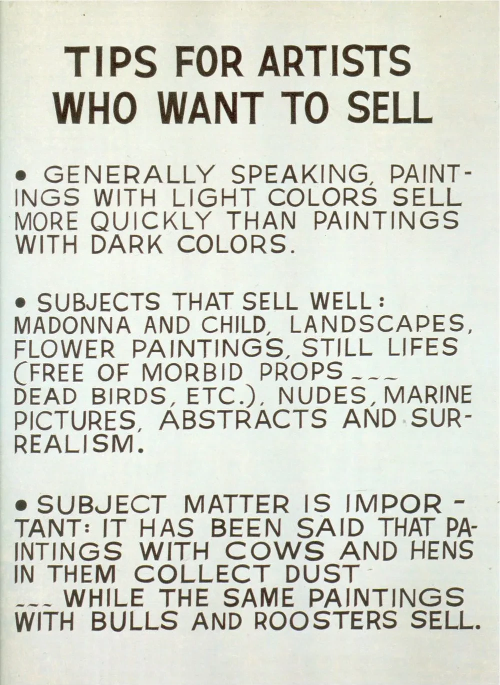

## Programme du semestre

29/09/2023 — [Des attentes comme réalité](expectations)  
12/10/2023 — Perspectives  
09/11/2023 — [Eric Schrijver, _Copiez ce livre_](copiezcelivre)  
23/11/2023 — [Miel Villemot, La Buse](labuse)  
07/12/2023 — [Stéphane Buellet, Chevalvert](chevalvert)    
21/12/2023 — [Argent et devis](argent)   
23/01/2024 — Fabrique Pola : Ora   
24/01/2024 — Fabrique Pola : Point de fuite  
14/02/2024 — Conférence API Conseil (propriété intellectuelle)  

## Ressources

::: gridlist

- ### [Copiez ce livre](https://www.lespressesdureel.com/ouvrage.php?id=10593&menu=0)
  Un manuel sur le droit d'auteur et les communs culturels, par et pour les artistes. Par Eric Schrijver, disponible dans la bibliothèque du second cycle. 

- ### [Droit d’auteur·ice et pratiques collaboratives](https://ddaoccitanie.org/fr/artistes/emmanuel-simon/reperes/droit-d-auteur-ice-et-pratiques-collaboratives-comment-s-emanciper-de-la-figure-conservatrice-de-l-artiste-solitaire) 
  Comment s’émanciper de la figure conservatrice de l’artiste solitaire. Entretien entre Caroline Sebilleau et Emmanuel Simon.

- ### [Entreprecariat](https://www.onomatopee.net/exhibition/do-or-delegate/#publication_9408)
  Un livre (en anglais) de Silvio Lorusso qui ouvre le débat sur l’entrepreneuriat précaire qui semble gouverner les logiques et structures économiques des artistes et designers. 

- ### [Fake it till you make it](http://revue-pneu.fr/fake-it-till-you-make-it/)
  Traduction par PNEU, revue de l’ÉSAD Valence, d’un fragment du livre _Entreprecariat, Everyone is an entrepreneur. Nobody is safe_, dans lequel Silvio Lorusso cherche à définir ce qu’est l’entreprécariat, un néologisme issu des mots entrepreneuriat et précariat 

- ### [Pour en finir avec la logique de l’aide…](https://la-buse.org/ressources/Petition-Buse-2-Pour-en-finir-avec-la-logique-de-laide-et-garantir-un-droit-a-la-continuite-du-revenu-aux-travailleureuses-de-lart) 
  …et garantir un droit à la continuité du revenu aux travailleur·euses de l’art. Une tribune portée par La Buse. 

- ### [Aujourd’hui, on dit travailleur·ses de l’art](https://www.369editions.com/aujourdhui-on-dit-travailleurses-de-lart/)
  Un livre de Julia Burtin Zortea, invite à repenser l’activité des artistes et des designers sous l’angle du travail, à s’organiser de manière collective et à repenser la notion même de travail.

- ### [Notre condition](https://riot-editions.fr/ouvrage/notre-condition/)
  Essai sur le salaire au travail artistique, par Aurélien Catin, membre du collectif La Buse et de l’association d’éducation populaire Réseau Salariat. 

- ### [Les Mondes de l’art](https://www.lespressesdureel.com/ouvrage.php?id=10593&menu=0) 
  Un “classique” de Howard S. Becker qui analyse la production de toute œuvre d’art comme une action collective et resitue l’artiste au cœur d’un jeu économique aux ateur⋅ices multiples. 

- ### [Vikhi Vahavek](https://www.lespressesdureel.com/ouvrage.php?id=10593&menu=0)
  Biographie d’une artiste très professionnelle. Un ouvrage collectif (dir. Mathilde Sauzet) qui raconte dix moments critiques de la vie d’une artiste fictive permettant de disséquer par des expériences concrètes l’injonction à la professionnalisation dans les écoles d’art. 

- ### [Fabrique POLA](https://pola.fr/ressources-pro)
  L’offre d’accompagnement aux artistes et designers de la fabrique POLA à Bordeaux. Pour tout⋅e adhérent⋅e (20€ / an), voir notramment les offres [Juri'Combi](https://pola.fr/ressources-pro/#conseil) et [Eco presto](https://pola.fr/ressources-pro/#conseil).

:::