Première proposition : un texte complexe à parcourir ensemble sous le mode de [l’arpentage](https://fr.wikipedia.org/wiki/Arpentage_(%C3%A9ducation_populaire)).

On s’y réfère à Pierre Bourdieu, bell hooks, Tomás Maldonado, même à Mike Monteiro, au design spéculatif et à des “étant-donnés” du design contemporain qui ne sont peut-être pas les vôtres.

Certains enjeux paradoxaux du design, aporiques, ou même _aporéthiques_ qu’on va parcourir ensemble étaient déjà présents dans un cours de Cultures numériques auquel certaines d’entre-vous se rappellent peut-être avoir assisté : [Design éthique, éco-design, low-techs](../../../culturenum/ethique/)[^nb].
[^nb]: Si les noms et les idées de William Morris, Raymond Loewy, Ken Garland, Ettore Sottsass ou Viktor Papanek ne vous sont pas familiers, [relisez ce texte ](../../../culturenum/ethique/).

[Silvio Lorusso](https://silviolorusso.com/) est un auteur, artiste et designer basé à Rotterdam, aux Pays-Bas. En 2018, il a publié son premier livre intitulé *[Entreprecariat](https://www.onomatopee.net/product/entreprecariat/)*. Il est professeur assistant et vice-directeur du *Centre for Other Worlds* à l’université de Lusófona à Lisbonne. Il est titulaire d’un doctorat en sciences du design de l’université Iuav de Venise[^sl].

[^sl]: Le 26/10/2023, Lorusso rendait public le résultat d’un séminaire consacré aux relations entre [Design et capitalisme](https://ma-information-design.github.io/resources/) ([pdf](/static/docs/all-caps_capitalism.pdf)) : un recueil de textes « qui permettrait aux étudiants, aux designers et aux chercheurs d'agir au sein d'un système capitaliste, tant sur le plan théorique que pratique, avec conscience et discernement ».

[The New Design Congress](https://newdesigncongress.org/) est une plateforme de recherche Fondé par Cade Diehm, qui « reconnaît que toutes les infrastructures sont des expressions de pouvoir et qui considère les interfaces et les technologies comme des accélérateurs sociaux, économiques, politiques et écologiques. ».  

---

Traduction approximative d’un essai tiré d’une conférence donnée par [Silvio Lorusso](https://silviolorusso.com/) à la _Yale School of Arts_ le 5 avril 2022 dans le cadre de la série « Paul Rand », publié sur _The New Design Congress_ : [Expectations as Reality](https://newdesigncongress.org/en/pub/expectations-as-reality).

---

> <big>Dans une période d’« inflation des diplômes », la disparité entre les aspirations que le système éducatif produit et les opportunités qu’il offre réellement est une réalité structurelle qui touche tous les membres d’une génération scolaire, mais à un degré variable selon la rareté de leurs qualifications et leur origine sociale.</big>[^pb]

[^pb]: [_La Distinction. Critique sociale du jugement_](https://fr.wikipedia.org/wiki/La_Distinction), Pierre Bourdieu, Les Éditions de Minuit, 1979

> <big>Le point de départ pour organiser les contenus de programmes d’éducation ou d’action politique doit être la situation actuelle, existentielle et concrète, reflétant les aspirations du peuple.</big>[^pf]

[^pf]: [_Pédagogie des opprimés_](https://fr.wikipedia.org/wiki/P%C3%A9dagogie_des_opprim%C3%A9s), Paulo Freire, 1968

Comment l’école d’art et de design produit-elle ses sujets, à savoir les designers professionnels ? Quels sont les valeurs, les critères et les mécanismes tacitement ou explicitement déployés dans l’enseignement ? Pour répondre à ces questions, j’explorerai la relation entre l’école et le monde dit réel, les affinités entre les anciennes et les actuelles vagues de protestations étudiantes, les cibles de la critique institutionnelle, le rôle du capital culturel et de la disposition critique dans la promotion des modèles professionnels émergents. En outre, j’essaierai de démontrer que le tournant largement humaniste du design, qui fait du designer un intellectuel de la technique, est moins une évolution spontanée du domaine qu’un résultat logique de la position instable du design au sein du domaine technique. Enfin, je proposerai une éthique du compromis contre celle, plus communément adoptée, de l’autonomie, cette dernière occultant plusieurs formes de dépendance.

L’école d’art et de design, vous la connaissez tous trop bien. J’utilise volontairement une expression générique car ce que je vais évoquer est partagé par diverses institutions dédiées à la culture des disciplines du design (académie, université, école privée, master, école d’été, etc.) Les raisons pour lesquelles j’insisterai de manière un peu pointilleuse sur le fait de maintenir l’art et le design ensemble deviendront évidentes, je l’espère, au cours de la présentation.

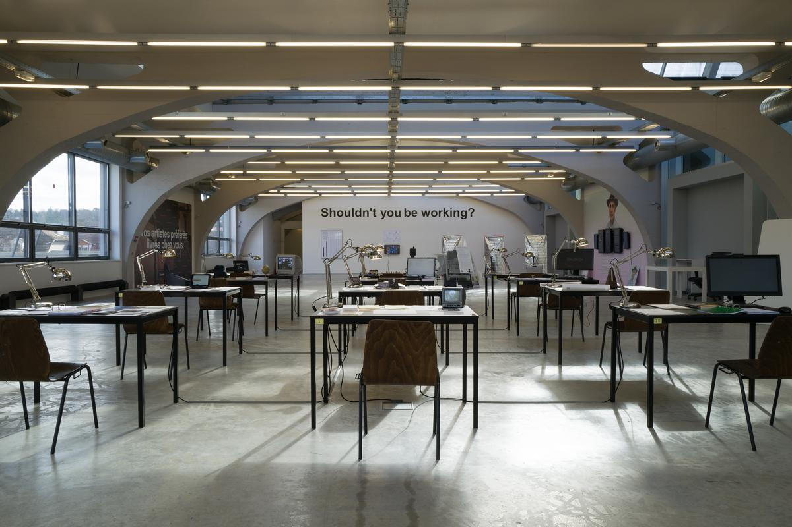

J’ai consacré ces dernières années au thème du travail, entendu comme une activité, un système de relations et, surtout, un _mythe_, c’est-à-dire une histoire que nous nous racontons à nous-mêmes et les uns aux autres[^entreprecariat]. Plus précisément, j’ai essayé d’offrir une perspective aussi réaliste que possible (et pour cette même raison pas du tout à l’abri des idéalisations et des placages rhétoriques) sur ce que l’on appelle le « monde réel », cette dimension qui suit, en théorie, la période d’étude. C’est précisément cette séquence qui, à mon avis, doit être reconsidérée. Commençons par là.

[^entreprecariat]: [Entreprecariat: Everyone is an entrepreneur nobody is safe](https://www.onomatopee.net/exhibition/do-or-delegate/#publication_9408), Silvio Lorusso, Onomatopee, 2019

## L’école est le monde réel

D’une manière générale, l’école est conçue comme un espace protégé de la brutalité désorientante du monde du travail. Traditionnellement, l’école était comprise comme le lieu privilégié de la vita contemplativa, par opposition au contexte professionnel, domaine de la _vita activa_. Il y a de nombreuses raisons pour lesquelles ce n’est pas le cas, et certaines d’entre elles sont spécifiquement liées au champ du design. Il y a de nombreuses années, Enzo Mari, un designer élevé au rang de « conscience critique du design », a fait remarquer que, si un diplôme de design est considéré au même titre qu’un produit, il est légitime d’affirmer que le secteur le plus impressionnant de ce domaine, y compris en termes de chiffre d’affaires, est l’« industrie » des écoles de design. Ainsi, les raisons structurelles du marché interagissent dès l’école avec les « espoirs, les stratégies et la naïveté » des futurs designers [^mari]. Ici, non seulement la culture du design est reproduite, mais les sujets qui s’y engageront sont générés.

[^mari]: [25 façons de planter un clou](https://www.lespressesdureel.com/ouvrage.php?id=8624), Enzo Mari, Mondadori, 8 janvier 2021

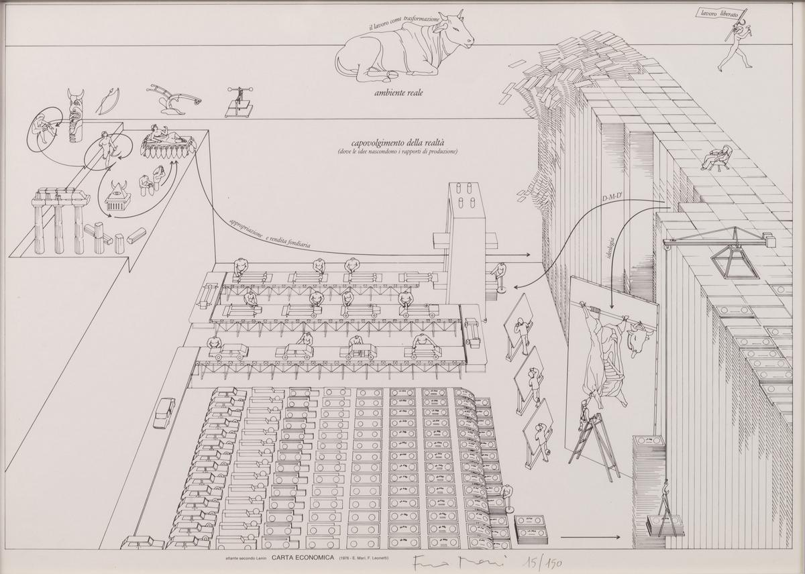

Mais il y a une autre raison, plus générale et plus alarmante, de considérer l’école comme un organe du monde réel. En temps de crise, elle protège de moins en moins des préoccupations typiques des travailleurs : les étudiants ne sont pas sans connaître la cherté des loyers, la pénurie de logements, les dettes diverses, les emplois mal rémunérés ou les stages qui ne le sont pas du tout. De plus, l’instabilité du marché du travail modifie le sens de l’expérience scolaire : dans un climat d’incertitude, il n’est pas nécessaire de connaître Gary Becker pour adopter instinctivement le prisme de l’_investissement_ lorsqu’il s’agit d’éducation. Bref, les problèmes de l’école ne se distinguent guère des problèmes de la vie.

Bien que moins protégée que nous l’imaginons, l’école d’art et de design reste, dans le meilleur des cas, un espace qui permet la pensée critique. Alors que dans le passé, la critique du design et par le design était principalement tournée vers l’extérieur (examinant, par exemple, les plateformes en ligne dominantes, la pollution et les idéologies qui guident les styles), nous assistons aujourd’hui de plus en plus à une critique autoréférentielle qui prend sa source dans les institutions et les pointe du doigt, en blâmant leurs valeurs et leurs modèles organisationnels. Le spectre de la critique institutionnelle, qui jusqu’à récemment hantait principalement les musées et les biennales d’art, apparaît désormais également dans les écoles de design.

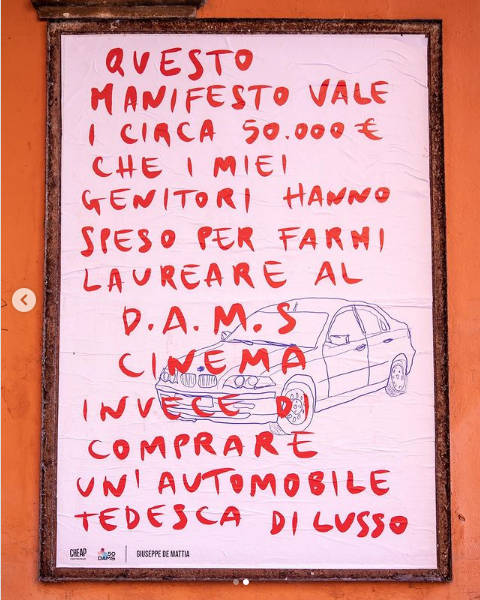

Ici, aux Pays-Bas (et ailleurs), un réseau de pages Instagram non officielles a vu le jour. Il s’agit de comptes anonymes, liés aux différentes académies, qui se livrent à une critique institutionnelle quotidienne et tous azimuts : absurdités bureaucratiques, sexisme, méritocratie factice, contrats précaires... le tout véhiculé par le langage des mèmes, à la fois ésotériques et accessibles, dépourvus du sérieux pédant typique des mouvements. C’est dans ces pages que, dans les mois les plus sombres de la pandémie, j’ai perçu la ferveur d’une communauté, bien plus que dans le paternalisme onctueux des communications officielles[^cf].

[^cf]: Voir mes entretiens avec [@wdka.teachermemes](https://www.instagram.com/wdka.teachermemes/) “[May the Bridges We Burn Light the Way](https://buttondown.email/otherworlds/archive/ow-3-may-the-bridges-we-burn-light-the-way-five/), Other Worlds, 26 juillet 2021. Également, T. ten Zweege, “[Calling Out Dutch Art Institutions](https://futuress.org/magazine/calling-out-dutch-art-institutions/)”, Futuress, 26 février 2021.

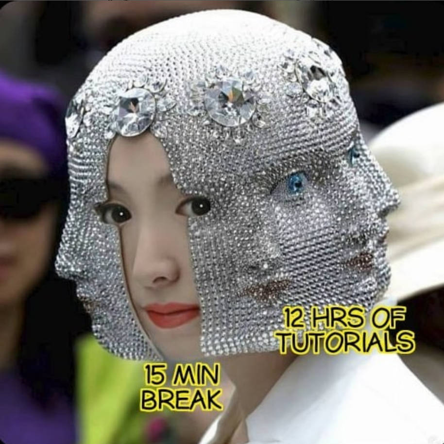

## Le Looooong 68

Ce n’est pas la première fois que les frontières entre l’école et le monde réel deviennent aussi fragiles et poreuses. Les manifestations étudiantes de 68 et 77 sont nées, hier comme aujourd’hui, d’un sentiment d’aliénation et de précarité. Elles ont été des événements colossaux capables de rompre le charme qui faisait de l’école un phénomène naturel et donc immuable.

Aux yeux de Giancarlo De Carlo, qui a analysé la crise des facultés d’architecture en Italie, les étudiants apparaissent comme des « passagers accidentels et étrangers dans une institution qui devrait être faite pour eux et qui ne se justifie que par leur présence ». Que dire alors de la faculté temporaire ? « Des cellules de spermatozoïdes à la recherche fébrile d’un ovule qui leur donne une configuration concrète. Ayant suivi avec un vif intérêt le débat des étudiants, De Carlo a rapporté intégralement les communiqués des étudiants de Turin :

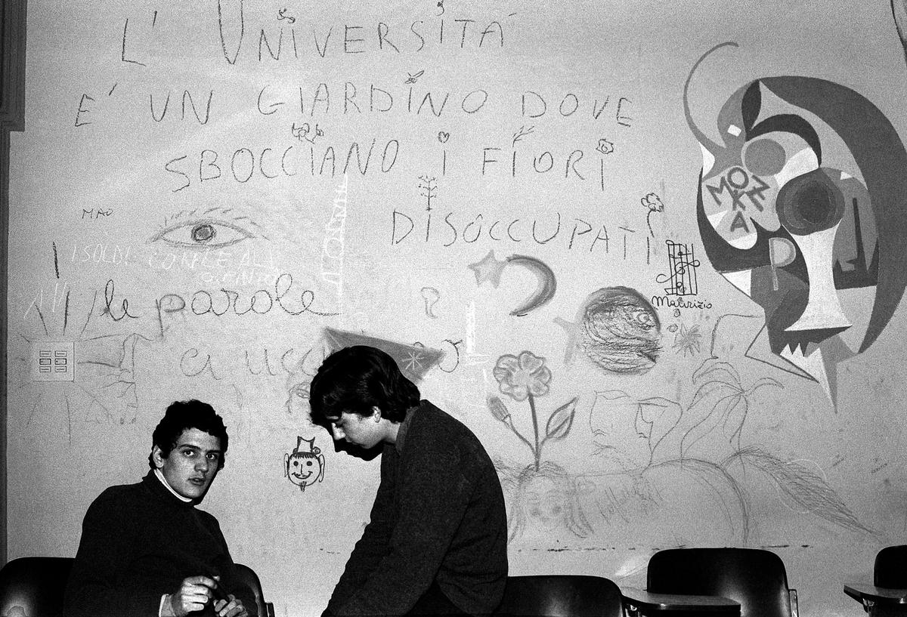

> _L’université actuelle ne répond pas aux besoins posés par la demande de travail existante dans la société. Notre objectif, cependant, n’est pas simplement de nous adapter aux besoins de la demande de travail. Nous pensons que l’université doit et peut fournir à ceux qui la fréquentent, en même temps, \[...\] une préparation professionnelle adéquate et des outils critiques._[^gc]

[^gc]: [La piramide rovesciata: Architettura oltre il ’68](https://www.storytel.com/es/es/books/la-piramide-rovesciata-architettura-oltre-il-68-1760596), Giancarlo De Carlo, Quodlibet, 16 avril 2020

Peu de choses ont changé. Les élèves sont de plus en plus conscients du « sort qui leur serait réservé une fois qu’ils auraient quitté l’école, désemparés dans un monde indéchiffrable »[^gc2].

[^gc2]: Ibid.

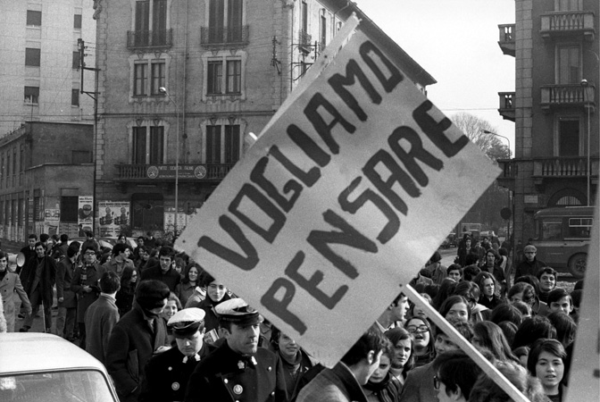

## L’école comme marché

Comme le suggère le communiqué, les étudiants et le corps enseignant comprennent l’école à travers un prisme réaliste ou idéaliste. Les réalistes sont unis par l’accent pragmatique mis sur l’emploi futur, les compétences et les besoins du marché. Les idéalistes, quant à eux, sont divisés entre pessimistes et optimistes. Les idéalistes pessimistes affirment que l’école est un lieu de discipline et de répression. Ils déplorent également l’assujettissement de l’éducation au marché du travail. L’école, selon ce point de vue, risque de devenir une usine, seulement égalitaire en apparence, de cadres d’entreprises, d’indépendants, d’ouvriers ou même de chômeurs. Les optimistes voient dans l’école un espace de libération par l’exercice de l’esprit critique et la suspension des idées reçues. D’un côté Ivan Illich, de l’autre bell hooks.

Tout le monde a raison, du moins en partie. Comment alors fusionner leurs positions respectives dans un modèle ? Il ne suffit pas d’affirmer que l’école d’art et de design fait partie intégrante du monde réel. Il n’est pas non plus correct d’opposer la préparation professionnelle au développement de la pensée critique. Par exemple, est-on vraiment sûr que l’école professionnalisante ne peut pas être libératrice, ou que l’émancipation n’est pas, dans certains cas, une forme de discipline ? Pierre Bourdieu propose une synthèse utile de la question. Pour le sociologue français, l’école est avant tout un marché où se forme et s’échange le capital culturel, mais surtout où il est légitimé et sanctionné [^pb2]. Parler de la culture comme d’un capital est crucial : c’est souligner que la culture, y compris la critique, peut être convertie en capital économique, c’est-à-dire en argent.

[^pb2]: [_La Distinction. Critique sociale du jugement_](https://fr.wikipedia.org/wiki/La_Distinction), Pierre Bourdieu, Les Éditions de Minuit, 1979

Le capital scolaire – l’ensemble des connaissances légitimées par l’école – est un sous-ensemble du capital culturel. À chaque niveau d’enseignement, l’apprenant apporte avec lui un héritage plus ou moins important (parfois même négatif !) de capital culturel, ainsi pondéré par l’institution scolaire. Personne n’entre à l’école les mains vides. L’école d’art et de design est un cas particulier car ici, plus qu’ailleurs, l’étudiant est encouragé à transformer son propre bagage culturel, surtout le plus personnel (intérêts, passions, hobbies, lectures, idéaux éthiques et politiques, etc.) en une « pratique », à savoir l’activité par laquelle la culture devient un profit et les consommateurs culturels deviennent des producteurs culturels.

Alors que l’« école émancipatrice » se révèle dans les ambitions apparemment autonomes des élèves et des enseignants, l’« école conservatrice » se cache dans le mécanisme de légitimation de ces mêmes ambitions. Il arrive ainsi que l’indignation, manifestation emphatique de l’esprit critique, devienne une valeur légitime, voire prescrite, comme je l’ai observé dans certaines académies. Mais cela n’élimine pas le mécanisme de légitimation _lui-même_, souvent tacite et fait de frictions, d’empêchements, de micro-censures, qui s’étendent de l’école au marché du travail. L’école va naturaliser certaines valeurs, tout en cachant en même temps la manière dont elle les légitime. L’une de ces valeurs est l’authenticité.

## Devenir soi-même

_La maison était l’endroit où j’étais forcé de me conformer à l’image que quelqu’un d’autre se faisait de moi et de ce que je devais être. L’école était l’endroit où je pouvais oublier ce moi et, à travers les idées, me réinventer._[^bell]

[^bell]: [Apprendre à transgresser: L’éducation comme pratique de la liberté](https://www.syllepse.net/apprendre-a-transgresser-_r_62_i_776.html), bell hooks, Syllepse, septembre 2019

L’école de bell hooks, une femme noire qui a grandi dans un environnement ségrégé et patriarcal, est l’antithèse de la maison : un territoire de réinvention en dehors des bastions de la tradition[^bell2]. L’école d’art et de design va plus loin et fait de la réinvention une redécouverte. Ici, l’accent est souvent mis sur l’authenticité du moi, sur ce que « vous et vous seul » pouvez faire ou apprécier. En adoptant une rhétorique de l’authenticité, les producteurs et les consommateurs de design se voient promettre de « devenir ce qu’ils sont ».

[^bell2]: Pourtant, comme nous l’avons vu, la séparation entre la maison et l’école est floue. On porte à l’école, toujours, volontairement ou non, une partie du fardeau domestique. Et il n’est pas certain que l’environnement scolaire soit moins conformiste que l’environnement familial.

À partir de cette considération, j’aimerais aborder l’éternelle question de la relation entre l’art et le design. Je ne souhaite pas ressusciter d’anciennes distinctions (travail commandé contre travail indépendant, rationalité contre intuition...), mais je me propose d’examiner la relation entre la design de soi et la design des choses (*design of the self and the design of things)*. Distinguer les deux n’est pas chose aisée. Après tout, le design n’est-il pas une pratique réflexive dans laquelle, en concevant le monde, nous nous redessinons nous-mêmes ? Et l’art n’est-il pas la fabrication d’artefacts qui sont en partie indépendants de la personne qui les crée ?

Les choses que nous concevons nous redessinent, sans aucun doute, mais il existe une distinction essentielle entre la design du soi et la design des choses. Cette distinction est rendue évanescente par l’éloge constant du glorieux designer qui déverse sa personnalité dans les choses qu’il conçoit. Le célèbre designer n’est qu’une pâle copie de l’artiste romantique qui survit dans les promesses de l’école et les espoirs des étudiants. Après tout, c’est une question de valeur. Alors que la dimension design de l’école d’art et de design tend à valoriser les choses et les services, sa dimension artistique – qui n’est certainement pas dépourvue de design – tend à valoriser l’expression d’une identité autonome et distincte. Ce que je suggère ici va plus loin : l’école d’art et de design est avant tout un laboratoire de _self-design_, et seulement secondairement un contexte où l’on conçoit des choses.

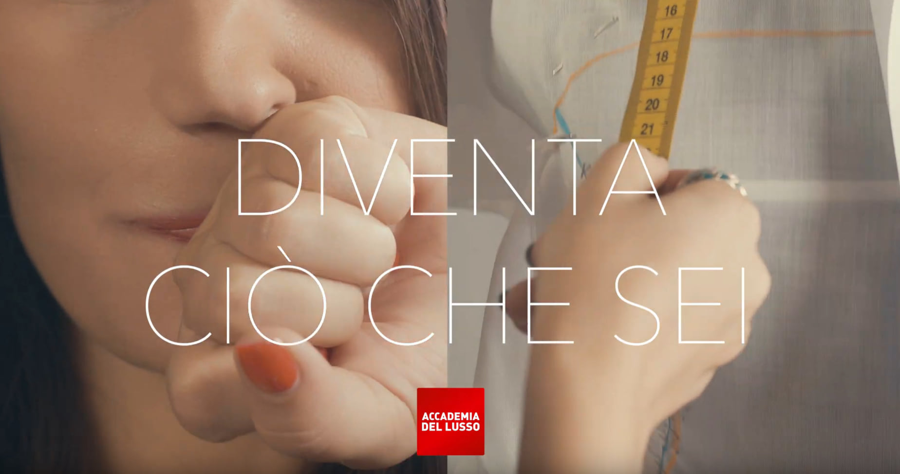

Personal branding, capital humain, politique de l’identité : de nos jours, le _self-design_, le « design de soi », est un projet mis en œuvre consciemment (et souvent de manière polémique). Dans quelle mesure s’agit-il d’une pratique libératrice ? Pour répondre à cette question, il est nécessaire de préciser que le _self-design_ est l’_une des données clés de la modernité_, à la fois opportunité et malédiction pour quiconque habite un environnement qui n’est pas entièrement traditionnel. Puisqu’il n’y a pas de trajectoires ou de « carrières » prédéfinies, on ne peut pas s’empêcher de se designer soi-même. La vie se présente à chacun comme une gamme plus ou moins restreinte de risques et de possibilités[^ezio]. En ce sens, l’élan expressif généralement associé à l’art n’est rien d’autre que le reflet de l’inéluctabilité typiquement moderne du _self-design_* Ce n’est pas un hasard si la créativité, synonyme populaire de l’art en tant qu’expression individuelle (et peut-être précisément pour cette raison désapprouvée par les designers), a acquis une telle primauté au cours des dernières décennies.

[^ezio]: C’est précisément à partir de cette considération que le théoricien du design Ezio Manzini décrit un état dans lequel « chacun doit constamment concevoir et redesigner son existence, qu’il le veuille ou non ». [Design, When Everybody Designs](https://mitpress.mit.edu/books/design-when-everybody-designs), Ezio Manzini, MIT Press, 16 April 2020

Le _self-design_ comporte un risque. Dans ses formes extrêmes, il est nombriliste et pathologiquement auto-réflexif : il peut être de la mauvaise littérature. En se confrontant de manière obsessionnelle au fantôme de l’identité, il est perturbé par une essence qui ne se manifeste pas toujours. Il n’est donc pas difficile de comprendre la déception de ces étudiants qui sont venus à l’école en croyant se confronter à un système d’idées et qui se retrouvent face à un miroir. Miroir de l’école émancipatrice de bell hooks, le _self-design_ est un raccourci pédagogique facile, puisqu’il délègue la définition du contenu aux élèves (« qu’est-ce qui vous tient à cœur ? »). Dans une époque dépourvue de modèles consensuels, la question « qui je veux être ? » est remplacée par un incessant « qui suis-je ? ». L’école devient un centre de recrutement des subjectivités.

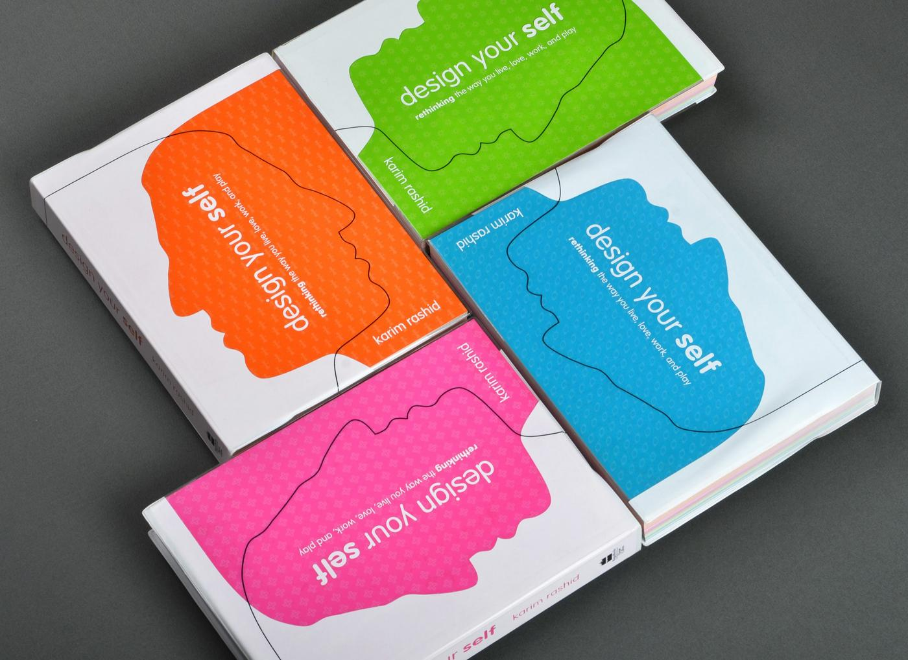

L’identité s’exprime par la différence, via le dispositif de distinction qu’est le goût. Nous ne devrions pas considérer le goût comme l’attitude snob du _connaisseur_, mais plutôt comme un système de préférences (des séries télévisées aux orientations politiques) qui constituent en fait des styles de vie. L’école d’art et de design fonctionne comme un marché des différences. Elle identifie et légitime les composantes identitaires et les transforme en compétences distinctives (comme celles, par exemple, du génie fou) à utiliser ensuite dans le monde du travail, en présentant certaines d’entre elles comme authentiques et donc inaliénables. Cette forme d’authenticité est, au moins en partie, un mécanisme caché aux autres et même à soi-même. Grâce à l’auto-hypnose de l’authenticité, des caractéristiques spécifiques peuvent apparaître comme _vraies_[^raffaele]. C’est ainsi que le sujet peut devenir ce qu’il est. Il est donc possible d’être inauthentique et sincère, ou insincère et authentique. Ce mécanisme permet d’expliquer, au moins en partie, le tournant autobiographique des écoles, déjà constaté depuis des années par plusieurs observateurs[^rob]. Cependant, l’encouragement de l’autobiographie s’accompagne de l’omission du fait que toutes les biographies ne sont pas également sacrifiables, que toutes les identités ne se prêtent pas à une conversion symbolique favorable. La mobilisation de l’identité et de la subjectivité fait donc partie intégrante de l’effort de professionnalisation. Examinons-la en détail.

[^raffaele]: L’essayiste Raffaele Alberto Ventura affirme que « le politiquement correct n’est pas un mérite inné mais rien de moins qu’une compétence acquise ». Je pense que c’est précisément le dispositif de l’authenticité qui fait apparaître cette compétence comme un mérite. [La mauvaise nouvelle, c’est que la cancel culture existe bel et bien.](https://www.wired.it/play/cultura/2021/05/10/cancel-culture-esiste-debunker-politicamente-corretto/) Wired, 10 mai 2021

[^rob]: Parmi eux, Rob Giampietro, qui a proposé une analogie entre l’école de design et les cours de création littéraire. « School Days ». [Conception graphique : En cours de production](https://linedandunlined.com/archive/school-days/). Ellen Lupton & Andrew Blauvelt. Walker Art Center, 2012

## Aspirations professionnelles

Le design est, comme l’art, protéiforme : ses limites changent constamment et de manière réflexive. Ce n’est pas une coïncidence si une grande partie de la littérature spécialisée, plutôt que de clarifier sa nature, tente d’orienter ses objectifs. Les écoles, en tant que lieux de la naissance de courants et de manifestes, participent activement de cet effort. Cela permet au charisme du maître, au kitsch du designer vedette, à la nostalgie de l’artisan, à la fierté de l’expert et, de plus en plus, à la lutte du·de la travailleur⋅euse de converger au sein du design[^rf].

[^rf]: Riccardo Falcinelli explique qu’aucune de ces attitudes n’est plus vraie que les autres : « Chacun choisira pour lui-même le type de concepteur ou de public qu’il veut être : il peut préférer le fonctionnalisme ou le design expressif ; il peut aspirer à une conception graphique strictement informative ou postmoderne ; il peut croire à l’efficacité ou pratiquer la performance. À condition de ne pas prendre ces convictions pour des vérités incontournables, à condition de les traiter pour ce qu’elles sont. C’est la seule façon de ne pas tomber dans les bas-fonds du moralisme, comme ceux qui croient qu’il n’y a qu’une seule bonne façon de faire les choses ». [Critica portatile al visual design](https://www.einaudi.it/catalogo-libri/arte-e-musica/arte/critica-portatile-al-visual-design-riccardo-falcinelli-9788806217716/) Riccardo Falcinelli, Einaudi, 2014

On pourrait dire, en paraphrasant Bourdieu, que puisque le design est un domaine fluide et déroutant, il permet des objectifs professionnels qui sont également fluides et déroutants [^pb3]. Son ambiguïté donne lieu à des aspirations qui ne sont jamais pleinement réalisées ni complètement frustrées, une ambiguïté qui est également utile aux jeunes ambitieux qui ne veulent renoncer ni au « vrai travail » ni à d’hypothétiques avantages symboliques[^ds]. Il est tentant de remplacer le diktat moderniste « moins c’est plus » par un « plus ou moins » plutôt vague…

[^pb3]: Pierre Bourdieu, *La Distinction*, op. cit.

[^ds]: *Breaking Class: Upward Climbers and the Swiss Nature of Design History*, Paola De Martin in [Design Struggles: Intersecting Histories, Pedagogies, and Perspectives](https://library.bgc.bard.edu/catalog/on1198095274), Claudia Mareis & Nina Paim (eds.), Valiz, 2021

L’imprécision intrinsèque du design a donc une logique précise : l’ambiguïté des aspirations propulse sa croissance. Elle s’accompagne cependant d’un phénomène récent. La professionnalisation, entendue comme la promotion du rôle du designer par les associations professionnelles, semble être un problème dépassé. Aggie Toppins, designer et conférencière américaine, a récemment affirmé que « l’impératif le plus pressant du domaine aujourd’hui n’est plus la professionnalisation ; il s’agit de faire de la pratique du design un élément responsable de la construction d’un avenir équitable et durable ». Pour preuve du succès des efforts de professionnalisation, Toppins rapporte que « le design graphique est désormais une matière principale très demandée dans les universités et qu’il est plus visible dans les médias populaires »[^ag]. Une déclaration qui confirme la thèse de Mari selon laquelle l’école serait la principale industrie du design.

[^ag]: [We Need Graphic Design Histories That Look Beyond the Profession](https://eyeondesign.aiga.org/we-need-graphic-design-histories-that-look-beyond-the-profession/), Aggie Toppins, AIGA Eye on Design, 10 June 2021

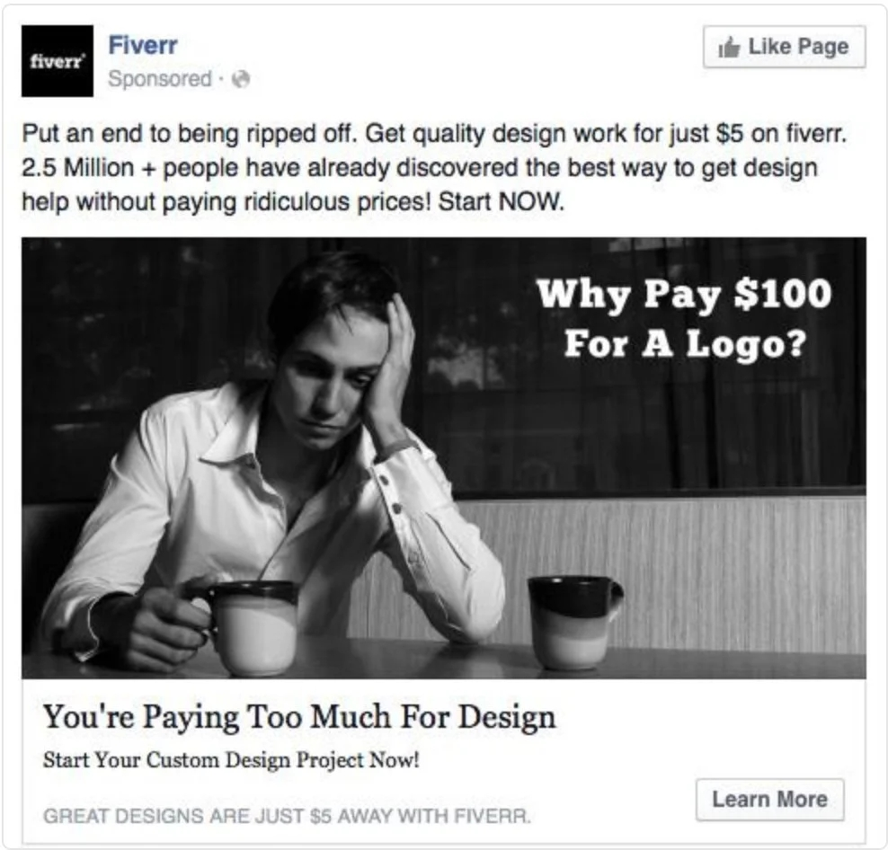

Il est essentiel de reconnaître, comme le fait Toppins, que la profession a historiquement été un moyen d’exclure les femmes, les minorités et les groupes opprimés. Mais il est également important de se rappeler qu’aujourd’hui, la question professionnelle est loin d’être résolue. Une étude portant sur 30 000 diplômé⋅es en design au Royaume-Uni (la branche la plus populaire de l’enseignement universitaire en licence) a montré que seul un quart d’entre elleux finit par occuper des emplois hautement qualifiés et bien rémunérés dans le domaine du design [^sd]. Si l’on considère le design graphique, le domaine qui m’est le plus familier, il suffit de jeter un coup d’œil aux enquêtes professionnelles sporadiques pour se rendre compte que le tableau est loin d’être rose. Selon le recensement annuel de l’AIGA, par exemple, un designer sur trois est insatisfait de son travai[^aiga].

[^sd]: [Design Most Popular University Choice – But Graduates Aren’t Ending up as Designers](https://www.designweek.co.uk/issues/12-18-february-2018/design-popular-university-choice-graduates-arent-ending-designers/), Sarah Dawood, Design Week, 15 February 2018

[^aiga]: AIGA [Design Census](https://designcensus.org/) 2019 

## L’élitisme de masse

Lorsqu’il s’agit du travail du design, on ne peut s’empêcher de parler de technologie. Démocratisation, automatisation et désintermédiation sont des mots-clés auxquels il est difficile d’échapper. Ruben Pater, designer et auteur néerlandais, résume ainsi le long débat autour de l’avènement de la publication assistée par ordinateur :

> _« En rendant notre travail si facile à réaliser, nous dévalorisons notre profession », a averti l’historien du design Steven Heller. « En démocratisant tout, nous risquons de perdre le statut d’élite qui nous donne de la crédibilité ». Cela n’a pas été le cas, comme le souligne Ellen Lupton dans son livre sur le design DIY, qui constate que « le domaine s’est agrandi au lieu de se réduire »[^rp]._

[^rp]: [Caps Lock](https://www.goodreads.com/book/show/57570873-caps-lock), Ruben Pater, Valiz, June 2021

Maintenant que le mot « élite » est presque devenu une insulte, il est certainement plus confortable de se ranger du côté d’Ellen Lupton. Cependant, la croissance du secteur attendue dans les 10 prochaines années est inférieure à celle des autres parcours professionnels – 3 % contre 8 % en moyenne[^w]. De plus – et c’est encore plus important – Heller a mis en évidence un problème de perception qui se traduit par une baisse des revenus et surtout des profits symboliques. C’est une réalité que les écoles ne peuvent pas prendre à la légère. A l’heure où une partie importante du corps étudiant n’a pas la possibilité de convertir son investissement éducatif substantiel en une position d’élite professionnelle, il y a un problème, et il n’est pas des moindres.

[^w]: [Graphic Designers median annual wages U.S. Bureau of Labor Statistics](https://www.bls.gov/ooh/arts-and-design/graphic-designers.htm#tab-5), 2021

L’expression « élite professionnelle » est presque tautologique. Selon le philosophe Donald Schön, un professionnel est quelqu’un qui « revendique des connaissances extraordinaires dans des domaines d’importance humaine, obtenant en retour des droits et des privilèges extraordinaires ». Cette définition montre que la profession est un rôle intrinsèquement exclusif (mais pas nécessairement _excluant_, comme cela a été le cas dans le passé).

[^pe]: [The Reflective Practitioner: How Professionals Think in Action](https://www.goodreads.com/book/show/57570873-caps-lock), Donald A. Schön, Routledge, 30 August 1994

Si les connaissances des designers ne sont pas considérées, au moins en partie, comme une forme d’expertise, ils seront difficilement reconnus comme des professionnels. C’est le cas, par exemple, du design graphique, un domaine dont le savoir-faire a perdu son aura ésotérique. La perception commune est que, grâce aux dispositifs numériques et au web, n’importe qui peut concevoir un logo ou un livre. Pour certains, le fait que le design graphique soit une matière universitaire est même une source d’étonnement.

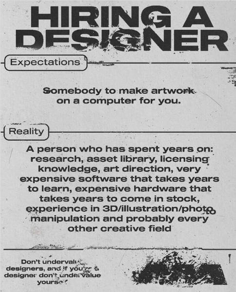

Mon objectif n’est pas de débattre de la justesse ou de la fausseté de cette perception. Mais de souligner qu’elle façonne les relations économiques générales entre clients et designers, et donc le statut du designer. Les effets sont déjà visibles dans l’écart salarial entre les spécialistes de l’UX design, un domaine encore considéré comme ésotérique, et ceux du design graphique, une pratique aujourd’hui démystifiée [^UX].

[^UX]: $74,000 of UX Designers vs. $41,000 of graphic designers. [How to Change Your Career from Graphic Design to UX Design](https://www.interaction-design.org/literature/article/how-to-change-your-career-from-graphic-design-to-ux-design), Teo Yu Siang, Interaction Design Foundation, 2020

On peut donc soupçonner que la professionnalisation est considérée comme un problème dépassé par ceux qui ont surmonté ce problème individuellement, c’est-à-dire ceux qui sont considérés comme des professionnels des effets, peut-être membres d’une élite culturelle, capables d’obtenir des avantages à la fois matériels et symboliques [^b].

[^b]: [See On Unprofessionalism](https://2x4.org/ideas/1994/on-unprofessionalism/), Michael Rock, 2x4, 1994

## Responsabilité économique

Il y a quelques mois, j’ai signé de tout cœur la lettre ouverte de Platform BK intitulée « Les diplômés des écoles d’art méritent d’être davantage maîtres de leur avenir »[^bk]. S’adressant aux conseils d’administration des académies d’art néerlandaises, les signataires affirment que l’enseignement devrait préparer les étudiants à « la réalité indisciplinée du marché de l’emploi dans le secteur culturel ». Le plan comprend quatre points : le développement de cours post-précarité ; l’engagement social et l’auto-organisation ; un aperçu du monde après l’académie ; et l’implication des étudiants dans les développements institutionnels.

[^bk]: [Graduates of art academies deserve more agency over their future](https://www.platformbk.nl/en/graduates-of-art-academies-deserve-more-agency-over-their-future/), Sepp Eckenhaussen, Platform BK, 13 décembre 2021

Une version antérieure de la lettre appelait à une « éducation artistique économiquement responsable ». La question est de savoir comment définir la responsabilité économique. Jusqu’à présent, j’ai essayé de montrer qu’il ne s’agissait pas seulement de revenus et de factures, ni d’un simple esprit d’entreprise, mais aussi d’inflexions du capital symbolique, entre la perception du public et la proprioception professionnelle.

Dans diverses écoles d’art et de design, les enseignant⋅es et les étudiant⋅es commencent à aborder le problème de la profession en prenant le point de vue d’un prolétariat exploité. Bien que, comme le montrent les données, il y ait de très bonnes raisons d’adopter cette position, elle a quelque chose d’autodestructeur : en acceptant à contrecœur la condition de néo-travailleur, les aspirations professionnelles légitimes des designers, qui sont évidemment tout sauf de la classe ouvrière, sont occultées. Je crois que c’est la raison pour laquelle l’appel générique à la syndicalisation ne donne pas les résultats escomptés au sein des professions du design. Nous sommes en présence d’un injonction contradictoire : l’école éduque les étudiants en tant que professionnels (« professionnels libres » en italien) mais exige d’eux une conscience prolétarienne. Un appel générique à la syndicalisation risque de trahir la promesse professionnelle du design[^unionise], non seulement en « créant des perdants », mais en transformant leur ressentiment en matériel pour les cours et les programmes[^losers].

[^unionise]: [No Problem: Design School as Promise](https://networkcultures.org/entreprecariat/no-problem-design/), Silvio Lorusso, Institute of Network Cultures, 7 December 2020

[^losers]: Je suis conscient du poids de cette expression et je ne l’utilise pas à la légère, tout comme les auteurs auxquels je fais référence ne l’utilisent pas à la légère.. Voir, notamment, Pierre Bourdieu, *La Distinction*, op. cit., et [_Une société sans école_](https://archive.org/details/DeschoolingSociety), Ivan Illich, Marion Boyars, 1971.

 met en scène le double bind (injonction contradictoire) professionnel : le slogan syndicaliste se heurte au visage agrandi d’un membre du studio, manifestation plus ou moins consciente de l’activité performative nécessaire à la constitution d’une aura professionnelle et culturelle à partir de sa propre individualité.")

## Le designer en tant qu’intellectuel

Le livre qui comprend la position susmentionnée d’Ellen Lupton a été écrit avec ses étudiants de MICA à Baltimore. C’est un livre qui est né dans une école. Dans le texte d’introduction, l’historienne américaine assimile la figure du designer à l’« intellectuel organique » gramscien. Considérant le design « comme une fonction _sociale_, plutôt que comme une profession ou une discipline académique », Lupton suggère ce qui suit :

> Ces intellectuels organiques pourraient fusionner le travail physique et mental, en construisant de « nouveaux modes de pensée » à partir d’actes d’exécution et de fabrication. Leurs compétences seraient à la fois techniques et théoriques[^lupton].

[^lupton]: [D.I.Y: Design It Yourself](https://ellenlupton.com/D-I-Y-Design-It-Yourself), Ellen Lupton, Princeton Architectural Press, 30 August 1994

Mais qu’est-ce qu’un intellectuel ? C’est à cette question que Tomás Maldonado, figure complexe et prolifique du design, a consacré tout un ouvrage de grande envergure, qui va de Cervantes à Jonathan Swift, d’Érasme à Heidegger. Selon Maldonado, l’intellectuel naît _engagé_. C’est un personnage qui « prend position » et signe des manifestes. Parfois, il a une fonction décorative au sein du parti qu’il soutient et par lequel il est soutenu. De plus, dès qu’il devient moderne, il ne peut s’empêcher de travailler sur lui-même :

> Il exprime « l’identité moderne », une manière d’être intellectuel qui privilégie la « réflexivité radicale ». Il est l’intellectuel « après Montaigne ». Avec Montaigne, « le moi entre en scène ». L’intellectuel naît replié sur lui-même, mais il s’offre au regard des autres[^maldonaldo].

[^maldonaldo]: [Che cos’è un intellettuale? Avventure e disavventure di un ruolo](https://www.ibs.it/che-cos-intellettuale-avventure-disavventure-libro-tomas-maldonado/e/9788807470004), Tomás Maldonado, Feltrinelli, 1995

L’affinité avec le prototype du designer envisagé et promu par l’école semble évidente : il s’agit d’un intellectuel qui prend position, critique et éduque, qui conçoit lui-même et fait de ce travail son propre contenu à diffuser, sa propre voix. Ce type d’intellectuel répond aux critères de l’acteur, mais qu’en est-il du faire propre au designer, de sa dimension technique ?

## Les deux cultures

Nous savons maintenant ce qu’est un intellectuel. Mais qu’en est-il du designer ? Maldonado propose une définition convaincante : le designer est un intellectuel technique[^maldo]. Il tente ainsi d’abolir la fausse dichotomie qui oppose la culture humaniste à la culture scientifique. Comme l’explique Giovanni Anceschi,

> L’expression « intellectuel technique » est un oxymore, mais elle ne l’est que selon la pensée banale et les préjugés schizoïdes qui continuent à croire aux « deux cultures ».

[^maldo]: Curieusement, le mot « designer » n’apparaît jamais dans son excursus sur le rôle de l’intellectuel.

La tentative de « chasser cette activité très concrète du milieu professionnaliste et pratique » est méritoire, mais les choses ne sont pas si simples. La difficulté réside dans le fait que la distinction entre dimensions technique et intellectuelle survit dans la perception générale des rôles professionnels, et que le designer est généralement perçu plus comme un technicien que comme un intellectuel.

<figure>
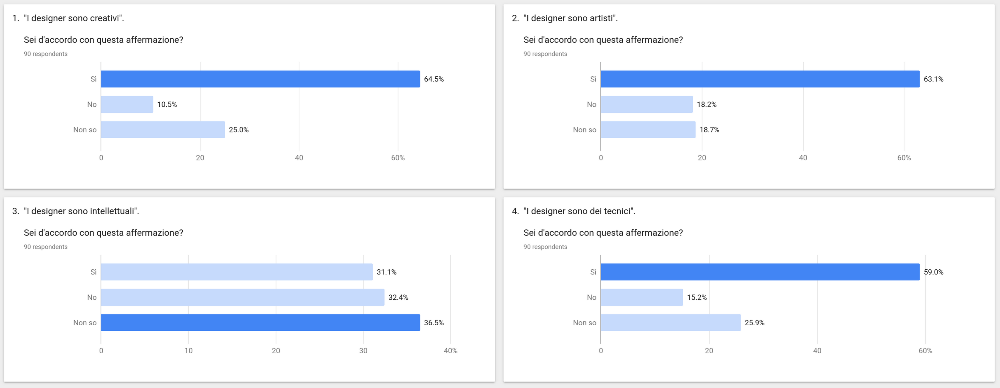
</figure>

↑ Enquête réalisée auprès d’un échantillon général de cent participants. La figure du designer est avant tout liée à la sphère de l’art et de la créativité. Les participants n’hésitent pas non plus à considérer le designer comme un technicien. En revanche, il y a de nets doutes sur le fait que le designer soit un intellectuel[^mal].

[^mal]: [Tomás Maldonado. Intellettuale politecnico](https://www.rizzolilibri.it/scheda-libro/9788898514533/), Giovanni Anceschi, Edizioni del Verri, 2020

Mais quel type de technicien ? Ce que Bourdieu affirme à propos de ceux qui occupent les positions inférieures de la classe dirigeante est vrai pour de nombreux designers. Ils « sont relégués à la position de _techniciens_, c’est-à-dire d’exécutants sans pouvoir économique, politique ou culturel[^pb4] ». C’est ce qui ressort des lamentations des différents sous-secteurs, non seulement du design graphique, qui est en déclin, mais aussi de ceux qui montent, comme le design d’interaction, qui réclame sa « place à la table ». Il y a donc une différence entre le technicien et le _technologue_, professionnel à part entière, synthèse reconnue des deux cultures.

[^pb4]: Pierre Bourdieu, *La Distinction*, op. cit.

Comment expliquer alors la propension intellectualiste, pour ainsi dire mono-culturelle, du design contemporain ? N’ayant pas réussi à s’imposer dans la sphère technique, le designer tente d’occuper la sphère humaniste. Il s’agit d’une démarche sensée, mais largement inconsciente, qui consiste à remplacer une élite technique (qui n’existe plus) par une pseudo-élite intellectuelle, qui se présente comme la « conscience » de la technique. L’école peut ainsi revendiquer un rôle formellement autonome, qui est l’exercice de la pensée critique et la production de la conscience. Dans leur dernier ouvrage, Mieke Gerritzen et Geert Lovink encadrent ce phénomène principalement européen par un titre cinglant : Made in China, Designed in California, Criticized in Europe [^mic].

[^mic]: [Made in China, Designed in California, Criticized in Europe](https://www.bispublishers.com/made-in-china-designed-in-california-criticised-in.html), Mieke Gerritzen & Geert Lovink, BIS Publishers, 2019

## Le problème des problèmes

Le passage de l’intellectuel technique à l’intellectuel de la technique est particulièrement évident dans le design spéculatif, également appelé design critique[^df] \[ou design fiction, NDT\]. Il s’agit de la pratique consistant à imaginer des scénarios futurs afin de repenser – et donc de transformer – notre présent.

[^df]: [Speculative Everything: Design, Fiction, and Social Dreaming](https://mitpress.mit.edu/books/speculative-everything), Anthony Dunne & Fiona Raby, The MIT Press, décembre 2013

Le manifeste fondateur du courant[^cdm], signé par Anthony Dunne et Fiona Raby en 2009, clarifie un certain nombre de principes. On passe d’une intention affirmative à une intention critique ; le design n’est plus destiné à la production mais au débat ; la provocation remplace l’innovation ; les applications font place aux implications. Il en résulte une figure somme toute similaire à celle de l’intellectuel humaniste traditionnel. Ce n’est pas un hasard si le design critique est aussi parfois appelé design pour le débat (_design for debate_).

[^cdm]: Voir [le manifeste de Dunne & Raby](http://dunneandraby.co.uk/content/projects/476/0).

. Collage de descriptions de projets de diplômés de la Design Academy Eindhoven. Afonso de Matos, 2022.")

Chaque courant a ses excellences et ses médiocrités. Il ne s’agit pas ici de déterminer la validité générale du design spéculatif, mais plutôt de donner les raisons de sa popularité, notamment dans les milieux pédagogiques et académiques. Malgré quelques précédents historiques reconnus par les designers spéculatifs eux-mêmes, la nouveauté réside dans la définition et la redéfinition des problèmes à travers des scénarios et des prototypes, plutôt que de se consacrer à leur résolution.

Ce faisant, le design spéculatif résout le _problème de l’accès aux problèmes_. En créant des fictions liées à la réalité et pourtant totalement autonomes, elle peut se déconnecter de la dimension concrètement sociale de la technologie, c’est-à-dire de ce que Galbraith appelait la _technostructure_, qui comprend les PDG, les décideurs politiques et les dirigeants d’entreprise[^nis]. De plus, sur le plan pédagogique, une telle pratique se prête à l’isolationnisme : un lien ténu avec la réalité suffit parfois à créer un monde fictif. Une réalité qui, pour de nombreux concepteurs, est d’ailleurs bâclée : si la résolution de problèmes est réduite à une simple exécution, le cadrage de problèmes a des allures de production culturelle, tâche traditionnelle des intellectuels.

[^nis]: [The New Industrial State](https://press.princeton.edu/books/paperback/9780691131412/the-new-industrial-state), John Kenneth Galbraith, Princeton University Press, 29 April 2007

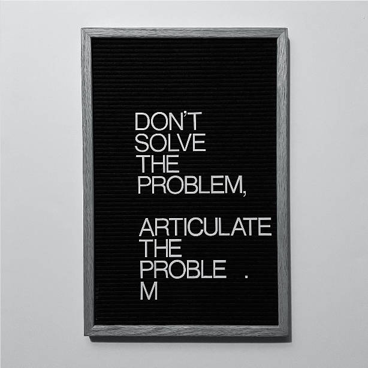

C’est ainsi qu’il faut lire le scepticisme généralisé à l’égard de la résolution de problèmes. Il ne s’agit pas seulement de mettre en scène la « méchanceté » des problèmes complexes, mais aussi d’échapper à l’obstacle social qui empêche de participer à leur résolution. Cela explique également la propension à enquêter sur des problèmes colossaux, car ils se prêtent parfaitement au regard médusé du critique. En se concentrant sur les systèmes les plus élevés, on peut ignorer les systèmes concrets dont on est exclu ou sur lesquels on n’a aucun pouvoir [^problems]. Pour reprendre les mots de Victor Papanek, « il est aussi dans l’intérêt de l’*establishment* de fournir des voies d’évasion de science-fiction aux jeunes, afin qu’ils ne prennent pas conscience de la dureté de la réalité[^papanek] ». Déployant des images de futurs préférables, ces « voies de la science-fiction » tendent inévitablement à mobiliser des notions d’éthique et de politique. Comme d’habitude, la question que j’aimerais poser est de savoir comment l’éthique et la politique fonctionnent dans le contexte de l’école d’art et de design.

[^problems]: [Design and Power – Part 1](https://buttondown.email/otherworlds/archive/ow-4-design-and-power-part-1-by-silvio-lorusso/), Silvio Lorusso, Other Worlds, 4 October 2021

[^papanek]: [Design for the Real World](https://www.goodreads.com/book/show/190560.Design_for_the_Real_World), Victor Papanek, Academy Chicago Publishers, 1972

## L’éthique impuissante

L’historienne britannique Alison J. Clarke écrit :

> Une grande partie du discours actuel sur le design soutient un modèle polarisé de design issu du paradigme largement néo-marxiste des années 1970 qui a alimenté la critique virulente de Papanek : \[...\] en répétant une rhétorique qui oppose une pratique du design moralement et éthiquement vertueuse (durable, socialement intégrée, basée sur la communauté, codifiée, etc. [^dfrw]

[^dfrw]: [Design for the Real World: Contesting the Origins of the Social in Design](https://library.bgc.bard.edu/catalog/on1198095274), Alison J. Clarke in Design Struggles, Claudia Mareis & Nina Paim (eds.), Valiz, 2021

Ce binarisme éthique est lié à l’inaccessibilité des problèmes. Des générations d’étudiants ont lu avec passion le manifeste First Things First de Ken Garland[^FTF], qui a été mis à jour et réédité plusieurs fois au cours des dernières décennies. La version originale, explicitement anti-consumériste, déplorait indirectement la réduction du designer à un simple exécutant d’un plan dont les « objectifs insignifiants » sont décidées par d’autres. La prise de conscience de Garland n’était donc pas seulement éthique, mais aussi positionnelle.

[^FTF]: [The First Things First Manifesto](http://www.designishistory.com/1960/first-things-first/), Ken Garland, 1964

Se référant à l’édition 2000 du manifeste, J. Dakota Brown affirme que « comme les tentatives précédentes de comprendre et de contester le statut du design en tant qu’ “institution de pouvoir”, la critique du manifeste a été rapidement réhabilitée en une affirmation apolitique du “pouvoir du design”[^pd] ». À y regarder de plus près, l’aspiration éthique du design exprime donc un auto-grandissement par excès de responsabilité. Lorsque les designers proclament que le design est génériquement responsable ou même coupable, ils disent également : « nous sommes importants, influents, voire décisifs ». Des exemples marquants de cet excès se trouvent à la fois dans des textes canoniques (tels que *Design for the Real World* de Victor Papanek) et dans des pamphlets récents, tels que Mike Monteiro :

> Le design est un métier à responsabilité. La responsabilité de contribuer à créer un monde meilleur pour tous. Le design est également un métier qui a beaucoup de sang sur les mains. Chaque publicité pour une cigarette nous concerne. Chaque arme à feu nous concerne. Chaque bulletin de vote qu’un électeur ne peut pas comprendre est de notre ressort.[^lol]

[^pd]: [The Power of Design as a Dream of Autonomy](https://goodpress.co.uk/products/the-power-of-design-as-a-dream-of-autonomy-by-j-dakota-brown), J. Dakota Brown, Green Lantern Press, 2019

[^lol]: [Ruined by Design](https://www.ruinedby.design/), Mike Monteiro, 2019

Cette sur-responsabilisation sert bien le contenu pédagogique des cours et des conférences, donnant l’impression que le design est moins une philosophie pratique qu’un cadre moral individualisé. Le fait de s’intéresser à l’éthique individuelle, composante fondamentale du *self-design*, est une façon de masquer sa propre subordination. Il ne fait aucun doute que les designers influencent la réalité par leur travail et leurs choix, mais cela se fait généralement d’une manière qui est loin d’être spectaculaire et qui ne correspond pas au mythe caricatural du « grand pouvoir dérivant d’une grande responsabilité ». En fait, de nombreux designers s’accordent à dire que la réussite d’un projet dépend en grande partie de la bonne volonté du client, comprise comme la confiance dans la compétence du designer[^trust].

[^trust]: 62% selon les [graphistes interrogés](https://www.graphicdesignand.com/product/graphic-designers-surveyed), Lucienne Roberts, Rebecca Wright et Jessie Price (éd.), Londres : GraphicDesign&, 2015

L’entité maléfique qui séduit, manipule et trompe les consommateurs, incarnée tantôt par l’organisation, tantôt par le client ou le designer lui-même, est souvent un homme de paille. Cette malfaisance abstraite est la cible polémique parfaite d’une école qui légitime un style de vie distinctif – _une attitude_, comme le décrit Moholy-Nagy. Cette attitude se caractérise par une affiliation à une sorte d’avant-garde morale dans laquelle ce que le positionnement professionnel, loin d’être garanti, ne peut pas, le positionnement éthique le peut.

## Économie politique

On me rappelle un article tristement célèbre et particulièrement amer de Paul Rand. J’imagine que certains d’entre vous le connaissent déjà, mais lisons tout de même un extrait :

> Dans le domaine de l’éducation comme dans celui des affaires, le design graphique est souvent un cas où l’aveugle mène l’aveugle. Faire de la salle de classe un forum perpétuel sur les questions politiques et sociales, par exemple, est une erreur ; et considérer l’esthétique comme de la sociologie est tout à fait trompeur. Un étudiant dont l’esprit est encombré de questions qui n’ont rien à voir directement avec le graphisme, dont l’objectif est d’apprendre à faire et à fabriquer, qui est jeté dans la mêlée entre l’apprentissage de l’utilisation d’un ordinateur, en même temps qu’il apprend les bases du graphisme, et qui est submergé par les problèmes sociaux et les questions politiques est un étudiant désemparé ; ce n’est pas ce qu’il a négocié, ni même ce pour quoi il a été payé [^randrant].

[^randrant]: [Confusion and Chaos: The Seduction of Contemporary Graphic Design](https://www.paulrand.design/writing/articles/1992-confusion-and-chaos-the-seduction-of-contemporary-graphic-design.html), Paul Rand, AIGA Journal of Graphic Design, 1992

C’est encore Aggie Toppins qui révèle l’histoire de cette diatribe. Furieux de la nomination de Sheila Levrant de Bretteville, une designer féministe associée au post-modernisme, au poste de directrice du cours de graphisme de Yale, Paul Rand a abandonné son poste au sein du département, convainquant Armin Hoffman de faire de même. Citant Roger Kimball, Rand a déploré l’apparente prédominance des « women’s studies, black studies, gay studies » sur les supposés « programmes et modes traditionnels de recherche intellectuelle[^randrant2] ». C’est comme si l’esprit de Jordan Peterson s’était emparé de lui rétrospectivement.

[^randrant2]: [Confusion and Chaos: The Seduction of Contemporary Graphic Design](https://www.paulrand.design/writing/articles/1992-confusion-and-chaos-the-seduction-of-contemporary-graphic-design.html), Paul Rand, AIGA Journal of Graphic Design, 1992

La critique d’Aggie Toppins sur cet article mérite d’être lue dans son intégralité[^atrand]. Ici, je vais plutôt extraire un grain de vérité de ce matériel presque irrémédiable. L’étudiant dérouté par les questions politiques n’est pas moins perdu que l’étudiant jeté dans un monde indéchiffrable décrit par De Carlo en 68. Malheureusement, la politique ne rend pas le monde moins complexe, et c’est là que réside sa valeur. Comme nous l’avons vu, la disposition éthique risque au contraire de réduire le politique à des binarismes élémentaires et à des manifestations d’indignation grandiloquentes qui servent à produire des compétences distinctives reconnues, peut-être, uniquement par les concepteurs eux-mêmes. C’est peut-être un bon spectacle, mais le bien-pensant n’est pas vraiment une offre éducative.

[^atrand]: [Good Nostalgia/Bad Nostalgia](https://www.tandfonline.com/doi/abs/10.1080/17547075.2021.2010876), Aggie Toppins, Design and Culture, 03 Sep 2019

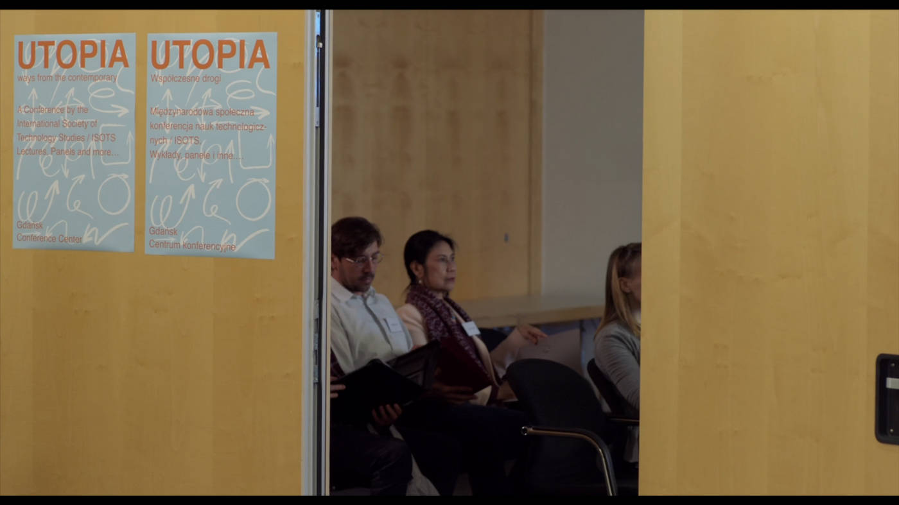

Comment tirer parti de la complexité politique dans le contexte éducatif ? En reconnaissant, entre autres, les aspirations professionnelles légitimes des élèves, y compris les moins « révolutionnaires ». L’inclusion ornementale de questions ouvertement politiques, le spectacle de l’indignation, les carrefours éthiques ne dédouanent pas l’école de ses lacunes professionnalisantes ; au contraire, ils peuvent contribuer à les obscurcir. C’est pourquoi, une école qui veut vraiment agir sur la soi-disant complexité doit plutôt étendre le domaine du politique vers une _économie politique_.

## Compromis

L’hystérésis. Bourdieu utilise un mot difficile pour décrire un phénomène trop simple, qui consiste à appliquer une perspective dépassée à un contexte muté. Le sociologue écrit :

> L’effet d’hysteresis est d’autant plus marqué que la distance au système scolaire est plus grande et plus faible ou plus abstraite l’information sur le marché des titres scolaires.

Il existe de nombreux témoignages informels de cet effet dans les contextes de l’art et du design. Joshua Citarella, un artiste américain, déclare à son auditoire composé d’étudiants et d’artistes émergents que « cette éducation et ce parcours professionnel vous forment à faire partie d’une classe professionnelle qui, en réalité, n’existe plus[^citarella] ». Roberto Arista, designer italien, réitère ce point en affirmant que « nos études professionnalisantes étaient basées sur un modèle qui s’effondrait déjà dans les années 90 et qui, dans les années 2000, n’était plus qu’un multiple décoloré de la matrice originale[^arista] ».

[^citarella]: Josh Citarella, story Instagram, 2021

[^arista]: [Interfaces Are a Solid Object](https://pythonfordesigners.com/chapters/interfaces-are-a-solid-object/), Roberto Arista, Progetto Grafico, January 2018

La façon dont l’école d’art et de design conçoit le *self-design* est désynchronisée. Le ciment de ses idéaux datés est le concept d’autonomie. Celle-ci se manifeste de différentes manières : détachement romantique des choses du monde, auto-conviction de l’essentialité sociale de ses compétences, repositionnement critique dans un contexte qui limite l’accès à la résolution de problèmes, déconnexion du présent et donc de l’histoire.

Dans un texte fondateur publié en 2003, Andrew Blauvelt, designer et conservateur américain, plaide en faveur de l’autonomie critique du design graphique. Il proposait que le design graphique soit compris comme « une discipline capable de générer du sens à partir de ses propres ressources intrinsèques sans dépendre de commandes, de fonctions, de matériaux ou de moyens spécifiques ». Plus un effet qu’une cause, l’autonomie critique est un éblouissement, une belle histoire à raconter dans les salles de classe et les musées. Comment alors remplacer cette apparente indépendance qui n’est en fait que le résultat d’un éloignement ? Reprenons Maldonado et Anceschi :

> \[…\] l’intellectuel technique, tout en pratiquant l’art stoïque et réaliste du compromis en design, n’est jamais un gestionnaire neutre, indifférent à la chose, au thème, à la substance.

Le compromis en matière de design est l’antithèse de l’autonomie critique. C’est un aveu du fait que le designer est, après tout, inévitablement un bricoleur – une personne qui fait avec ce qu’elle trouve, dans les conditions dans lesquelles elle se trouve. Cela ne signifie pas que le compromis en matière de design soit docile ou victimaire. Il s’agit plutôt d’une critique du compromis, d’une prise de conscience des raisons qui guident cette prise de conscience. Il s’agit également d’un compromis historique : la capacité et le courage de distinguer le passé du présent. Perfectionner l’art du compromis en matière de design signifie reconnaître le compromis de l’école en tant que partie intégrante du monde réel. Cela signifie qu’il faut surmonter la proprioception professionnelle pour accepter la perception qu’ont les autres de son rôle, en particulier lorsque cette perception s’avère désagréable.

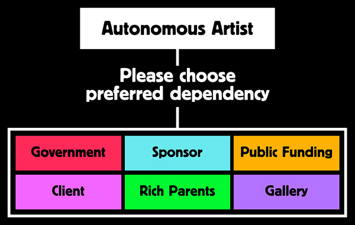

Une école d’art et de design qui veut s’inscrire dans une éthique du compromis doit être à la fois idéaliste et réaliste. Pour ce faire, elle doit être capable d’examiner les ambitions mêmes qu’elle produit et les mécanismes, tant internes qu’externes, qui légitiment ces ambitions. Si l’école veut devenir un espace de réalisation de soi, elle doit reconnaître les processus de professionnalisation du soi, puis les dépasser.

Merci à Caterina Di Paolo, Michele Galluzzo, Gui Machiavelli et Cade Diehm pour leurs précieux commentaires.

~

Silvio Lorusso est un auteur, artiste et designer basé à Rotterdam, aux Pays-Bas. En 2018, il a publié son premier livre intitulé *Entreprecariat*. Il est professeur assistant et vice-directeur du *Centre for Other Worlds* à l’université de Lusófona à Lisbonne. Lorusso est titulaire d’un doctorat en sciences du design de l’université Iuav de Venise.

----

## Notes éparses

Gary Becker développa la théorie du capital humain : [Théorie du capital humain](https://fr.wikipedia.org/wiki/Capital_humain).

D’Ivan Illich, voir [Une société sans école](https://1000idcg.com/societe-sans-ecole-ivan-illich/).

Sur bell hooks, lire [La pédagogie engagée](https://journals.openedition.org/traces/5852) + Apprendre à transgresser, L’éducation comme pratique de la liberté (Zlib) : «Apprendre aux élèves à « transgresser » les frontières raciales, sexuelles et de classe afin d’atteindre le don de la liberté est, pour hooks, l’objectif le plus important de l’enseignant.» Et acheter (à prix libre) [Comprendre le patriarcat](https://atelier-temeraire.tumblr.com/post/680971191792615424/comprendre-le-patriarcat-cinqui%C3%A8me-impression) chez l’Atelier Téméraire.

[Pierre Bourdieu](https://journals.openedition.org/edso/1191) dénonce l’_idéologie du don_ de la tradition pédagogique, « qui ne s’adresse en fait, sous les dehors irréprochables de l’égalité et de l’universalité, qu’à des élèves ou des étudiants qui sont dans le cas particulier de détenir un héritage culturel conforme aux exigences culturelles de l’école ». La Distinction (sous-titré Critique sociale du jugement) est un ouvrage publié en 1979 par Pierre Bourdieu qui élabore dans une perspective sociologique une théorie des goûts et des styles de vie.

[Ezio Manzini](https://fr.wikipedia.org/wiki/Ezio_Manzini)

[Aggie Toppins](https://aggietoppins.com/), [Can We Teach Graphic Design History Without the Cult of Hero Worship?](https://eyeondesign.aiga.org/can-we-teach-graphic-design-history-without-the-cult-of-hero-worship/)

[Tomás Maldonado](https://en.wikipedia.org/wiki/Tom%C3%A1s_Maldonado) 

Sur Entreprécariat, de Silvio Lorusso : [L’ère de l’entreprécariat](https://legrandcontinent.eu/fr/2020/10/26/lere-de-lentreprecariat/)

Paola De Martin and Afonso de Matos : [Classism and Design: On the Social Implications of Studying Design](https://futuress.org/learning/classism-and-design/)