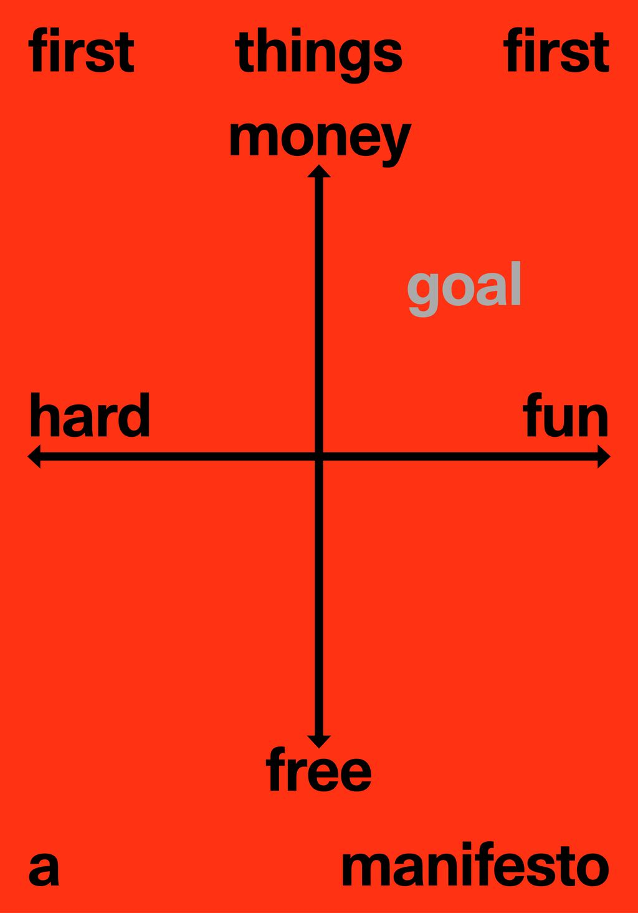

[**Building Paris**](https://www.buildingparis.fr/) est un studio de direction artistique et de design graphique basé à Paris et fondé par Benoît Santiard et Guillaume Grall. Leur travail est caractérisé par une approche engagée dans les enjeux de l’édition, et animé par une passion pour le détail typographique. Dans le prolongement de leur pratique, ils enseignent la communication à l'École d'architecture de la ville & des territoires Paris-Est. En 2029, en parallèle de leur activité de studio, ils ont fondé [Building Books](https://buildingbooks.fr/), une maison d'édition dont le catalogue s’oriente vers l'architecture, l’urbanisme, le paysage et l'art contemporain. Leur double activité porte de nombreux enjeux liés aux questions économiques, et c’est à ce titre qu’ils viendront évoquer les modalités de leur pratique.

<h2>Building tools&nbsp;</h2>

comment on gère le boulot dodo : avec quels outils ? comment et pourquoi ?

Affiche : diagramme argent/épanouissement (cf. Ikigai japonais ? schéma trouvable sur internet mais pas de photos sur le pad ): )

au début bcp de boulot et pas bcp d'argent, après on travaille et ça paye mais c'est très demandant, entre faire le travail et le trouver.

money ↔ free / hard ↔ fun

L'affiche en question (pour les 10 ans du studio Abmo) : <a href="https://media.licdn.com/dms/image/v2/D5622AQGju3GHKZjX4g/feedshare-shrink_1280/feedshare-shrink_1280/0/1729691411250?e=1735776000&amp;v=beta&amp;t=zN0yFBEThz5h1GJEb5vUjq781vz99OmS_KtrfTzLkJ8" rel="noreferrer noopener">https://media.licdn.com/dms/image/v2/D5622AQGju3GHKZjX4g/feedshare-shrink_1280/feedshare-shrink_1280/0/1729691411250?e=1735776000&amp;v=beta&amp;t=zN0yFBEThz5h1GJEb5vUjq781vz99OmS_KtrfTzLkJ8</a>

<a href="https://www.dropbox.com/scl/fi/12iqbhpzpu43fh9nlvcz2/Abmo_GG-05_preview.jpg?rlkey=fi3m4cz5n6d5778aysjo91hps&amp;dl=0" rel="noreferrer noopener">https://www.dropbox.com/scl/fi/12iqbhpzpu43fh9nlvcz2/Abmo_GG-05_preview.jpg?rlkey=fi3m4cz5n6d5778aysjo91hps&amp;dl=0</a>

Réalisation de plusieurs petits projets en annexes de la pratique régulière -&gt; projets qui équilibrent la balance.&nbsp;

Objectif a terme, rapporter de l'argent avec une activité dans laquelle on s'épanouie.&nbsp;

Comme des logos, fanzines, affiches, cartons d'invitation, cartes de visite… des projets pour lesquels il y a besoin d'un.e graphiste, des choses un peu plus niches...

le travail amène le travail

Guillaume Grall :&nbsp;

activités multiple&nbsp; → Graphiste de diplôme, puis enseignement (communication et représentation), papa, entrepreneur x2 → également pour gerer les activités de la maison d'édition, éditeur, coach et arbitre de basket :)

Association avec Benoît Santiard (sous forme de SAS) : doubles entrepreneurs (deux sociétés !)

design → aventures collectives&nbsp;

<ul class="list-indent1"><li>Travail collectif -&gt; intégration de l'atelier de création graphiques dirigé par Pierre Bernard ? (pas sure du nom) <a href="https://www.cnap.fr/pierre-bernard" rel="noreferrer noopener">https://www.cnap.fr/pierre-bernard</a> ??? &gt; oui, c'est bien lui : <a href="https://vimeo.com/126783156" rel="noreferrer noopener">https://vimeo.com/126783156</a> &lt;3</li></ul>

perennité de la clientèle → rencontres&nbsp;

espaces de travail : activités, rencontres, partage -&gt; avec des gens avec qui on travaille régulièrement OU de nouvelles personnes -&gt; nourrit le travail, la créativité

Comment on travaille -&gt; L'écriture graphique, au sens large (préalable d'un projet)

« Écriture&nbsp; » =&gt; graphique, logicielle

Sa passion pour le basket l'a rapproché d'une certaine pratique du design -&gt; logo, magazines, éditions, identité ...

les magazine, logos, identité visuelle → l'a amené au design graphique&nbsp;

pareill pour la musique (☆DJ Mehdi☆ -&gt; 7Kings, compilation de musiques)

<h4>Conseil : Aimer ce que l'on fait et faire ce que l'on aime !</h4>

Autre domaine : la musique -&gt; projet DJ Mehdi. -&gt; découvertes d'un large champ référentiel dans le milieu musical.&nbsp; [ DJ Mehdi → <a href="https://www.arte.tv/fr/videos/RC-025704/dj-mehdi-made-in-france/" rel="noreferrer noopener">https://www.arte.tv/fr/videos/RC-025704/dj-mehdi-made-in-france/</a> ]

Mixtape 7Kings en particulier : <a href="https://www.youtube.com/watch?v=0zLxm0ZT4Ns" rel="noreferrer noopener">https://www.youtube.com/watch?v=0zLxm0ZT4Ns</a> (le volume 2 était loin du rap &gt; le sampling comme porte vers d'autres références musicales : blues, jazz, pop, etc.)

Le DG est perpétuellement en contact avec d'autres disicplines

Apesct aussi plus vernculaire du design -&gt; rue, graffiti -&gt; typographie&nbsp;

design graphique au contact avec d'autres domaines, disciplines&nbsp;&nbsp;&nbsp;&nbsp;

Christopher Wool (<a href="https://fr.wikipedia.org/wiki/Christopher_Wool" rel="noreferrer noopener">https://fr.wikipedia.org/wiki/Christopher_Wool</a>) &gt;&gt;&gt; <a href="https://wool735.com/" rel="noreferrer noopener">https://wool735.com/</a>

David Poullard -&gt; jeux de mots, typographie : synthèse de toutes leur influences- "à ce-qu'on dit" (<a href="https://exb.fr/fr/le-catalogue/47-precis-de-conjugaisons-ordinaires.html" rel="noreferrer noopener">https://exb.fr/fr/le-catalogue/47-precis-de-conjugaisons-ordinaires.html</a> + <a href="https://belordinaire.agglo-pau.fr/expositions/contre-ordre#extra" rel="noreferrer noopener">https://belordinaire.agglo-pau.fr/expositions/contre-ordre#extra</a>)

écriture automatique : technique des surréalistes visant à traduire « aussi exactement que possible la <i>pensée parlée -&gt; def du robert&nbsp;</i> --&gt; permet de se questionner sur comment faire le design, réflexion sur les formes et la typo.

LC⚡DC → Le Club des Chevreuils (<a href="http://leclubdeschevreuils.free.fr/lcdc/" rel="noreferrer noopener">http://leclubdeschevreuils.free.fr/lcdc/</a>) : trouver des nouvelles formes d'écriture. Jouer avec les mots, le sens. Pas de questions de forme/style

Typo vernaculaire : écriture sans écriture : Panneaux publicitaires&nbsp; "à louer"-&gt; présence textuelle dans l'espace public. -&gt; grosse typographie et jeu autour de l'esthétique des textes de panneaux.&nbsp;

→ dimmension "pro", réelle : commande par la ville de Chaumont pour les journées du patrimoine : mettre en appplication pour une "vraie" occasion -&gt; économie de formes car peu de moyens et de temps.

la deuxième année → 💵💵💵💵

Building Paris → studio design graphique début en 2012→ au service du contenu, du contexte/environnement

Devoir enseigner a permis de formuler concrêtement les enjeux graphiques et de definir les objectifs et les compétences.

Mots clés pour définir Building : contenu, évidence, contexte, détail, contrainte.

« Varying in subject and scale, our work is characterized by a distinct directness, and driven by a passion for typographic detail »

Building index : galerie de tous leurs projets.

2012 mis en commun de tous leurs projets, pour créer un seul studio : building paris

écrire à deux&nbsp;

système d'archivage des projets en les numérotant (plusieurs centaines en 12 ans) :

&nbsp;&nbsp;&nbsp; <b>7 sous-dossiers </b>: 1-administration, 2-fabrication, 3-fontes, 4-textes, 5-images, 6-présentation, 7-work, 8-archives

(« présentation » → importance de la médiatisation / médiation de l’avancement du projet !) la présentation permet de montrer toute la démarche.

Organisation chronologique

« Générer du contenu ne peut se faire que si on comprend ce sur quoi on travaille. C'est une question de procédure, pas d'esthétique. Cela signifie : si les choses sont bien pensées, les formes seront bonnes » - Renaud Huberlant, graphiste et enseignant belge (c. 2010)

« La forme, c'est le fond qui refait surface » - Victor Hugo

Les formes sont une résultante de choses pensées au préalable. On parle moins des choses que du fond.&nbsp;

il y a donc moins de “j’aime ou je n’aime pas” - les formes sont moins discutées&nbsp;

Jamais plus d’une seule proposition ! (proposer des variantes d'une même idée, mais jamais de directions différentes &gt; sinon risque de vouloir synthétiser des choses qui n'ont rien à voir ensemble)

L'architecture à une manière de penser les projets qui leur a plu. On part de l'esquisse, de la maquette, jusqu'au projet concret, la construction "lourde".

C'est pas tant le logo qui compte, mais ce qu'on fait. (pas tant la forme qui compte mais ce qu'elle traduit finalement ?)

Un logo n'est jamais seul : penser usage, penser global (système d'identité général)

Le site web devient un outil pour le client (ici l'architecte : <a href="https://www.buildingparis.fr/images/#quinton" rel="noreferrer noopener">https://www.buildingparis.fr/images/#quinton</a>), notamment au travers d'un exercice de création d'index.

Voir <a href="https://www.jeanbenoitvetillard.com/" rel="noreferrer noopener">https://www.jeanbenoitvetillard.com/</a>, <a href="https://www.quinton-architect.com/" rel="noreferrer noopener">https://www.quinton-architect.com/</a>

Note pour plus tard : Travailler avec des gens de sa génération, pour grandir ensemble, autant en tant que client/commanditaire que collaborateurice !

→ partage de références, de codes

Penser à faire des outils qui vont être pratiques :

nous on met en place des identités en tant que designers graphique mais c’est le client qui l’utilise

Faire utiliser des codes graphiques par des personnes qui ne sont pas graphistes est une chose difficile.

Puiser dans les références des clients pour construire une esthétique qui leur correspond. Pas faisable avec tout le monde&nbsp;

<i>-Valerio Olgiati, Architecte suisse (1958-) :</i>

<i>Valerio Olgiati, né le 18 juillet 1958 à Coire, en Suisse, est un architecte suisse (</i><a href="https://www.olgiati.net/contact_link-book.html" rel="noreferrer noopener"><i>https://www.olgiati.net/contact_link-book.html</i></a>)

<i>-Barozzi / Veiga is an architectural office devoted to architecture and urbanism, that was founded in 2004 in Barcelona by Fabrizio Barozzi and Alberto Veiga.</i>

<a href="https://barozziveiga.com/" rel="noreferrer noopener"><i>https://barozziveiga.com/</i></a>

<a href="https://www.buildingparis.fr/gallery/egr/" rel="noreferrer noopener">https://www.buildingparis.fr/gallery/egr/</a> &gt; Police Kessler Display Regular de chez Production Type

<a href="https://productiontype.com/font/kessler" rel="noreferrer noopener">https://productiontype.com/font/kessler</a>

<a href="https://www.atelieregr.com/" rel="noreferrer noopener">https://www.atelieregr.com/</a>

L'écriture (la fonte) peut faire image&nbsp;

être curieuxeuse avec les gens avec qui on travaille&nbsp;

répartition de l'argent&nbsp;

Move audacieux : séparer le budget en 2 et en réserver la moitié pour faire photographier les projets du client (architecture = maquettes, batiments, espace de travail). Complémentarité entre design graphique "sec", "pauvre", mais photographies +chaleureuses.

-&gt; Moins d'argent pour Building ☹️ mais projet + abouti pour le client😀☺☺

&gt;<b> </b><b>On a</b><b> </b><b>les clients qu'on mérite</b> (?)

"épuisement"

question d’écriture de la typo - manière de travailler la typo assez triviale et pragmatique = très souvent un préambule d’un projet car besoin d’écrire un projet, le mettre en mot, le formuler

Type is tool -&gt;&nbsp;

utilisation de certaines typos par périodes données. On a tous.tes ( souvent) des typos par défaut, qu'on affectionne remployer souvent.&nbsp;

typo de défaut → en début de projet → utilisée par automatisme, aide à formuler

<a href="https://optimo.ch/typefaces/antique_legacy" rel="noreferrer noopener">https://optimo.ch/typefaces/antique_legacy</a> (vs <a href="https://lineto.com/typefaces/unica77?tab=specimen" rel="noreferrer noopener">https://lineto.com/typefaces/unica77?tab=specimen</a>, vs <a href="https://radimpesko.com/fonts/agipo" rel="noreferrer noopener">https://radimpesko.com/fonts/agipo</a>)&nbsp; ← sur Agipo, lire <a href="https://fontreviewjournal.com/agipo/" rel="noreferrer noopener">https://fontreviewjournal.com/agipo/</a>

Union plutôt que Agipo (même si on l'a aussi utilisé à un moment ;-) <a href="https://radimpesko.com/fonts/union" rel="noreferrer noopener">https://radimpesko.com/fonts/union</a> (synthèse de l'Arial et de l'Helvetica)

Ancienne Type chouchou : <a href="https://lineto.com/typefaces/unica77" rel="noreferrer noopener">https://lineto.com/typefaces/unica77</a>

Utilisation de la même typo sur 2 projets différents : pas dérangeant car le résultat final n'est pas le même.

(il faut “apprendre” à utiliser un caractère typographique)

remployer le même outil pour plusieurs projets à la suite permet d'améliorer a chaque fois son usage et d'en comprendre toutes ses possibilités. -&gt; <b>exploiter et épuiser l'outil au maximum</b>.&nbsp;

→ "réemployer pour s'améliorer" permet de gagner en expérience et en temps car habitué par l'outil = savoir ce qui va "marcher" ou ce qui va être possible avec.

Notion du partage -&gt; aventures collectives -&gt; faire des projets avec d'autres personnes -&gt; ouvrir une porte, inviter d'autres créateurices sur les projets.&nbsp;

fabrique d’un projet se fait avec plusieur(e)s collaborateurices (imprimeurs, photographes,...) : pas juste nous et le commanditaire

faire appel aux copaines, connaissances

ex : Graphisme en France - 2014 &gt; <a href="https://www.buildingparis.fr/gallery/graphisme/" rel="noreferrer noopener">https://www.buildingparis.fr/gallery/graphisme/</a>, ont fait appel à plusieurs ami(e)s pour faire les polices de caractères

soyez généreux.se avec les autres &gt; les autres vous le rendront un jour ou l'autre

Création du caractère knif (ka.nif) -&gt; création d'une affiche à partir de spécimens réalisés par plusieurs personnes. -&gt; collaboratif -&gt; passer commande à des gens dont on apprécie le travail. Le travail partagé peut donner lieu à des rencontres, des lancements, des evenements -&gt; désir de paratge matérialisé par le travail. Des projets au service des échanges.&nbsp;

<a href="https://aisforfonts.com/knif" rel="noreferrer noopener">https://aisforfonts.com/knif</a>

Books make friends, design and typo too

Design makes friends

Typography makes friends

évènements = partages&nbsp;

<a href="http://www.dextersinister.org/MEDIA/PDF/KellerLetter.pdf" rel="noreferrer noopener">http://www.dextersinister.org/MEDIA/PDF/KellerLetter.pdf</a>

double activité&nbsp; → dont éditeurs

⇒ avaient toujours eu la casquette d’éditeur, mais sans jamais sauter le pas avec des projets tels que <i>Notre-Dame-Des-Landes ou le métier de vivre</i> (<a href="https://www.editionsloco.com/livre/notre-dame-des-landes-ou-le-metier-de-vivre/" rel="noreferrer noopener">https://www.editionsloco.com/livre/notre-dame-des-landes-ou-le-metier-de-vivre/</a>)

<a href="https://www.buildingparis.fr/images/#landes" rel="noreferrer noopener">https://www.buildingparis.fr/images/#landes</a>

Créer une maison d'édition c'est avoir la possibilité de travailler avec d'autres graphistes et de passer sous la casquette de l'éditeur -&gt; on retrouve la notion de collaboration et de pratage.&nbsp;

Passer d'exécutif à commanditaire sur plusieurs projets -&gt; opportunités et expériences intéréssantes.&nbsp;

le choix des gens avec qui ont travaille

Armand Mevis&nbsp;

Comment on fabrique un livre ? -&gt; chaque livre commence par une idée

On fait des livres parce qu'on en a envie, parce qu'on en a l'opportunité et parce qu'on peut collaborer avec des gens interessants.&nbsp;

The Form&nbsp; of the Book Book (<a href="https://occasionalpapers.org/product/the-form-of-the-book-book/" rel="noreferrer noopener">https://occasionalpapers.org/product/the-form-of-the-book-book/</a>)

gift/cadeau :&nbsp;

&nbsp;&nbsp;&nbsp; <a href="https://www.dropbox.com/scl/fi/7i1rwt9uel2rwpf1xdikf/C-ArmandMevis-EveryBook.pdf?rlkey=7iu7ew1rmmo9n8ef4pwf92q9f&amp;dl=0" rel="noreferrer noopener">https://www.dropbox.com/scl/fi/7i1rwt9uel2rwpf1xdikf/C-ArmandMevis-EveryBook.pdf?rlkey=7iu7ew1rmmo9n8ef4pwf92q9f&amp;dl=0</a>

&nbsp;&nbsp;&nbsp; <a href="https://www.dropbox.com/scl/fi/697m0wbvha5vbblhn721r/AM_FR.pdf?rlkey=l9ru3z8bl7j0ijm6qg6nvnn9g&amp;dl=0" rel="noreferrer noopener">https://www.dropbox.com/scl/fi/697m0wbvha5vbblhn721r/AM_FR.pdf?rlkey=l9ru3z8bl7j0ijm6qg6nvnn9g&amp;dl=0</a>

<a href="https://buildingbooks.fr/product/agora" rel="noreferrer noopener">https://buildingbooks.fr/product/agora</a>

comprendre/ savoir si on est utile, à quel moment on l'est

Négocier des échanges (troc, don/contre-don) pour avoir des textes ou des images

un livre prend du temps à se faire, au moins 1 an (en moyenne, entre le moment où l'on parle du projet pour la première d-fois et le jour où les cartons arrivent), prévision sur l'année suivante

"le temps, ce n’est pas (toujours) de l’argent" &gt; très important de considérer le temps et l’argent que l’on gagne&nbsp;

100% de son chiffre d’affaire = 50% de son quotidien où il ne gagne pas d’argent

Toggl :: gestion du temps au quotidien → comment bien optimiser son temps

<a href="https://toggl.com/" rel="noreferrer noopener">https://toggl.com/</a>

<pre><code>
            ________
    o      |   __   |
      \_ O |  |__|  |
   ____/ \ |___WW___|
   __/   /     ||
               ||
               ||
_______________||________________</code></pre>

:)))&nbsp;

prochaine carte de visite, merci ;-)

<h2>Questions</h2>

LCDC sur le web des débuts ? (évolution esthétique depuis LCDC vers BP ? → toujours plus “sec” ?)

Votre approche très typographique peut-elle être perçue comme une signature ?

Plutôt une question d'évidence et d'esthétiques/pratiques qui s'assument.

Et l’argent ?&nbsp; → équilibre à trouver entre projets rémunérés et projets free/moins bien rémunérés.

→ La/les fréquence.s de commandes demandées au studio (dans une année par ex)? Le temps de réalisation pour un "gros" projet (à peu près)?&nbsp;

C'est pas tant le nombre de projets qui nous arrivent que le nombre de projets que l'on est prêt à supporter : d'où l'importance de choisir ses projets et de ne pas (toujours) tout accepter ;-)

Notre rythme de travail repose sur cet équilibre : on préfère travailler sur plein de petits projets que VS travailler sur peu de gros projets. Ça nous permet aussi de nous renouveller plus souvent.

ON A LES CLIENTS QU’ON MÉRITE ?¿

↑ de l’importance des bons commanditaires

Pas s’étonner d’avoir des expériences ± agréables au début ; l’aprentissage de la pratique globale du design (gestion de projet, relation aux commanditaires, etc.) passe nécessairement par des échecs, des trucs frustrants, mais l’expérience et l’apprentissage peuvent permettre d’aller vers de “meilleurs” clients / commanditaires.

le luxe de pouvoir choisir ou refuser les clients en fonction de ce que ça va nous apporter

Savoir, au début d'un projet/d'une rencontre, pourquoi on vous a choisi. Les raisons de ce choix vous aideront à vous positionner : si choix par défaut ou sans réel intérêt pour votre travail, "take the money and run" (ou "run" tout court si pas besoin de "money"). Travaillez avec des gens qui vous ont choisi pour de bonnes raisons : parce qu'ils ont aimé un projet que vous avez fait, parce qu'ils savent comment vous travaillez parce que vous avez des valeurs communes, etc.

Aujourd'hui on évite : les projets gratuits où les gens sont relous et exigents (hard/free) + les projets bien réuménérés mais qui nous prennent la tête et du temps (hard/money). Toujours se demander "pourquoi je fais ce projet ?" (pour l'argent ? pour le fun ? pour le prestige ? pour la liberté ? pour l'affect ? etc.)

Comment estimer un travail de conception de logo, quand celui-ci est principalement (un choix) typographique ?

Créer / construire un _système_ d’indentité visuelle dont le logo n’est qu’un élément (pas forcément le plus important).

Questions de positionnements, penser un tout, un ensemble qui justifie la place du logo typo.

Vendre ses applications ! Combien de temps, d'affecte celui-ci vaut !

Penser à optimiser son temps : outils, méthode, expérience :)

- Merci

LE TROC !

Lors de travaux à plusieurs sur des projets : comment se passe la répartition du travail ? Rôles définis ou organisation fluide, apport d'idées/participation sur le moment ?

Chez Building, il y a un "chef de projet" pour chaque projet (on se répartit les projets en fonction de l'envie, de la dispo et des affinités). Puis chacun gère et accompagne le projet du début à la fin, en sollicitant l'autre pour discuter et l'aider si impasse ou questions. Travailler à 2 sur un même projet ne nous a jamais fait gagner du temps… au final, mes projets sont les projets de BS et vice-versa. Peu importe qui fait quoi, on partage tout (réussites, échecs… mais aussi temps, argent). Cela nécessite juste de la confiance et d'accepter un positionnement commun (engagement, exigence) et en même temps les différences et complémentarités de&nbsp; chacun.

—

À écouter ;-)

Deux podcasts intéressants sur la pratique du design graphique et du statut d’indépendant :

Graphic Matter, épisode 47 avec Pierre Vanni :&nbsp;

&nbsp;&nbsp;&nbsp; <a href="https://podcasts.apple.com/us/podcast/ep-47-pierre-vanni-le-danger-de-nos-m%C3%A9tiers-est/id1617637140?i=1000674823185" rel="noreferrer noopener">https://podcasts.apple.com/us/podcast/ep-47-pierre-vanni-le-danger-de-nos-m%C3%A9tiers-est/id1617637140?i=1000674823185</a>

The Bold Way, épisode 176 avec Bildung :&nbsp;

&nbsp;&nbsp;&nbsp; <a href="https://podcasts.apple.com/us/podcast/bildung-ind%C3%A9pendance-revalorisation-des-ind%C3%A9pendants/id1300541489?i=1000550770722" rel="noreferrer noopener">https://podcasts.apple.com/us/podcast/bildung-ind%C3%A9pendance-revalorisation-des-ind%C3%A9pendants/id1300541489?i=1000550770722</a>

 
