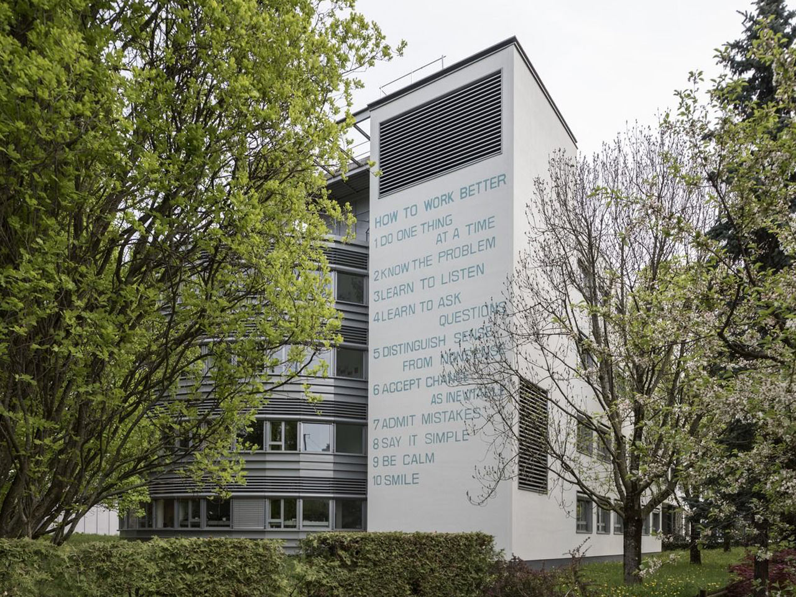

## Calendrier

- 03/10/2024 — Welcome to the cruel world 
- 17/10/2024 — [Le plaisir et l’argent](le-plaisir-et-largent)
- 31/10/2024 — [Éditions Burn Août](editions-burn-aout) 
- 14/11/2024 — [Praticable](praticable)
- 28/11/2024 — [Building Paris](building-paris)
- 17/12/2024 — [Caroline Sebilleau & Benoît Brient](caroline-sebilleau-et-benoit-brient)
- 09/01/2024 — Questions collectives et individuelles

Chaque session fait l’objet d’une prise de notes collaborative.

## Autres invité⋅es

- [Sécurité sociale des artistes auteur⋅ices](https://www.secu-artistes-auteurs.fr/) : 11 octobre de 9h à 11h
- [IP4Artist](https://ip4artist.api-conseil.app/) — mars/avril 2025
- [POLA : Point de fuite & Ora](https://pola.fr/) : 23 & 24 janvier 2025
- [SAIF](https://saif.fr/)
- [Alliance France Design](https://www.alliancefrancedesign.com/)

## Ressources

(Recyclage partiel mais éhonté des propositions de 2023–2024)

::: gridlist

* #### [About contracts: Ten things I wish I had known about contracts](https://letterror.com/articles/contracts.html)
  Un article de Just Van Rossum, _aka_ LettError, sur les enjeux des contrats à établir en tant que _type designer_. Témoignage utile pour les dessinateur⋅ices de caractères autant que pour les designers graphiques.

* #### [Comment survivre après l’école d’art](http://surfaces-utiles.org/how-to-survive-after-art-school-comment-survivre-apres-lecole-dart.html)  
  Publié par Surfaces Utiles, cet ouvrage partage un ensemble de combines, trucs et astuces qui ont permis à des travailleur·euses du milieu de l’art et du design de s’en sortir après l’école.

* #### [Copiez ce livre (toujours d’actualité)](](https://www.lespressesdureel.com/ouvrage.php?id=10593&menu=0))  
  Un manuel sur le droit d’auteur et les communs culturels, par et pour les artistes. Par Eric Schrijver, disponible dans la bibliothèque du second cycle.

* #### [Aujourd’hui, on dit travailleur·ses de l’art](https://www.369editions.com/aujourdhui-on-dit-travailleurses-de-lart/)  
  Un livre de Julia Burtin Zortea, invite à repenser l’activité des artistes et des designers sous l’angle du travail, à s’organiser de manière collective et à repenser la notion même de travail.

* #### [Entreprecariat](https://www.onomatopee.net/exhibition/do-or-delegate/#publication_9408)  
  Un livre (en anglais) de Silvio Lorusso qui ouvre le débat sur l’entrepreneuriat précaire qui semble gouverner les logiques et structures économiques des artistes et designers.

* #### [Fake it till you make it](http://revue-pneu.fr/fake-it-till-you-make-it/)
  Traduction par PNEU, revue de l’ÉSAD Valence, d’un fragment du livre _Entreprecariat, Everyone is an entrepreneur. Nobody is safe_, dans lequel Silvio Lorusso cherche à définir ce qu’est l’entreprécariat, un néologisme issu des mots entrepreneuriat et précariat.

* #### [What Design Can’t Do: Essays on Design and Disillusion](https://www.setmargins.press/books/what-design-cant-do/)  
  Le design est en panne. Les jeunes et moins jeunes designers en sont de plus en plus conscients. Beaucoup se sentent impuissants : on leur a dit qu’ils avaient les outils pour rendre le monde meilleur, mais au lieu de cela, le monde leur fait payer un lourd tribut.

* #### [CAPS LOCK: How capitalism took hold of graphic design, and how to escape from it](https://valiz.nl/publicaties/caps-lock)
  Un livre sur l’intrication relationnelle du design et du captialisme. En anglais (Yuyuan l’a lu, demandez-lui :), publié par Valiz, écrit par Ruben Pater, aussi auteur de…

* #### [The Politics of Design](http://thepoliticsofdesign.com/about-the-book)   
  Un livre qui explore le contexte culturel et politique de la typographie, de la couleur, de la photographie, des signes, symboles et infographies que nous voyons chaque jour (et que nous manipulons).

* #### [Pour en finir avec la logique de l’aide…](https://la-buse.org/ressources/Petition-Buse-2-Pour-en-finir-avec-la-logique-de-laide-et-garantir-un-droit-a-la-continuite-du-revenu-aux-travailleureuses-de-lart) 
  …et garantir un droit à la continuité du revenu aux travailleur·euses de l’art.  Une tribune portée par La Buse.

* #### [Droit d’auteur·ice et pratiques collaboratives](https://ddaoccitanie.org/fr/artistes/emmanuel-simon/reperes/droit-d-auteur-ice-et-pratiques-collaboratives-comment-s-emanciper-de-la-figure-conservatrice-de-l-artiste-solitaire)  
  Comment s’émanciper de la figure conservatrice de l’artiste solitaire. Entretien entre Caroline Sebilleau et Emmanuel Simon.

* #### [Notre condition](https://riot-editions.fr/ouvrage/notre-condition/)
  Essai sur le salaire au travail artistique, par Aurélien Catin, membre du collectif La Buse et de l’association d’éducation populaire Réseau Salariat.

* #### Fabrique POLA
  L’offre d’accompagnement aux artistes et designers de la fabrique POLA à Bordeaux. Pour tout⋅e adhérent⋅e (20€ / an), voir notramment les offres [Juri’Combi](https://pola.fr/ressources-pro/#conseil) et [Eco presto](https://pola.fr/ressources-pro/#conseil).

:::